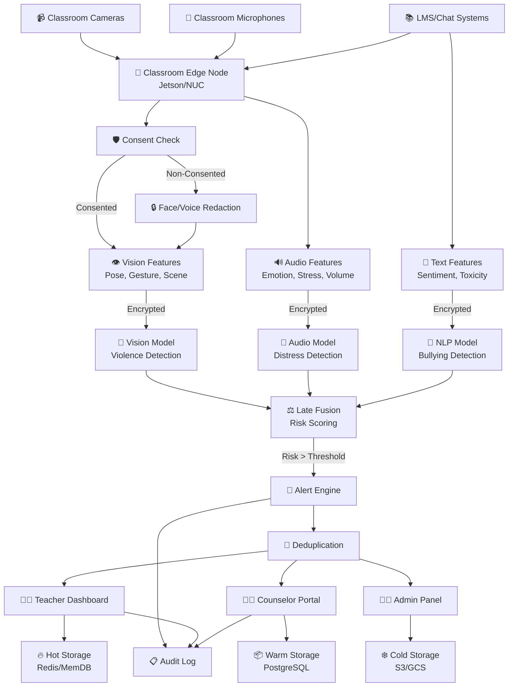
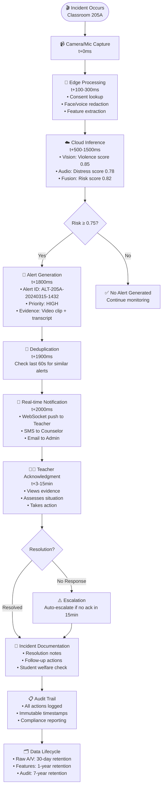
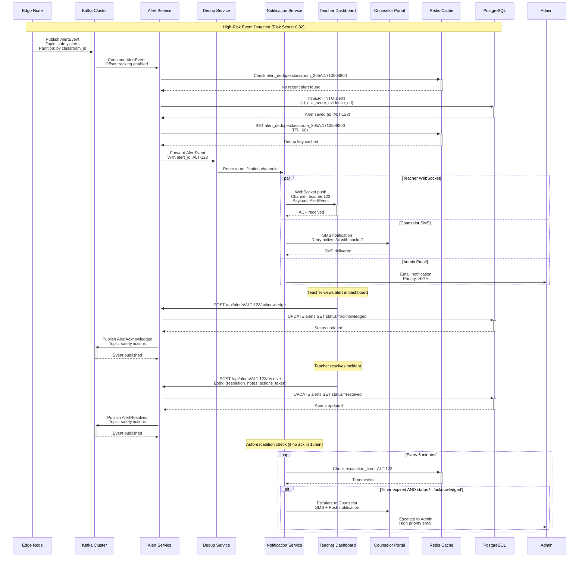

# System Architecture

## Logical Architecture Diagram

## End-to-End Incident Flow

## Real-time Alerting Sequence

## Data Processing Pipeline

### Edge Processing (Classroom Level)

**摄像头部署密度**（基于实际调研数据）：
- **教学楼走廊**：每层 8-12 台（间距 < 15 米）
- **教室内部**：每室 1 台（后墙高位安装，400 万像素广角镜头，覆盖角度 ≥ 110°）
- **实验室**：每室 2-3 台（重点设备聚焦）
- **操场/体育馆**：每 400㎡ 1 台（全景 + 特写）
- **食堂操作间**：关键点位 100% 覆盖

**边缘处理能力**：

* **Input**: 原始音视频流（4K 30帧/秒，6通道音频）
* **同意检查**: 实时查询同意数据库，支持分级授权机制（可选择性屏蔽子女画面）
* **隐私去标识化**: 人脸检测 + 语音频谱遮罩，采用行为模式分析（排徊检测）替代直接监控
* **特征提取**: 轻量级姿态检测、音频特征提取，支持 ResNet3D 动作分析、微表情 AU4/AU7 识别模型
* **Bandwidth**: 通过边缘预处理减少 90% 带宽占用

### Cloud Inference (Regional Level)

**五大核心检测场景**：
1. **考场压力崩溃**：手部颤抖频率 > 3Hz、皱眉强度 > 0.8、心率 > 100BPM 等触发条件
2. **群体孤立型霸凌**：座位排斥率 > 80%、社交平台恶意话题、群体排斥行为分析
3. **厕所自残行为**：隔间门振动模式、次声波特征匹配、异常握持姿势检测
4. **教师语言暴力**：贬低词频监测、学生微表情识别、权力压迫指数 > 0.854
5. **网络溯源追踪**：匿名账号行为分析、元数据提取、键入节奏生物特征库

**AI模型管道**：

* **视觉管道**: EfficientNet-B4 用于暴力/攻击行为检测，支持微表情 AU1+AU4+AU15 识别
* **音频管道**: Wav2Vec2 + EmoBERTa 用于情绪识别，教师麦克风独立拾音系统
* **文本管道**: RoBERTa-Large 用于霸凌分类，Legal-BERT 压迫指数模型，校园 WiFi 活动词库扫描
* **后期融合**: 加权集成并进行置信度校准，多模态置信度 > 0.7 生成证据包，分级响应（L1-L3）

### Storage Tiers

1. **Hot (Redis)**: 活跃警报、用户会话、实时缓存
2. **Warm (PostgreSQL)**: 警报元数据、用户数据、分析结果
3. **Cold (S3/Glacier)**: 原始证据、长期审计日志

## Key Design Decisions

### Privacy-First Architecture

* **Edge-centric processing**: 最大限度减少离开教室的数据
* **Consent-driven redaction**: 自动遮蔽未同意对象
* **Homomorphic encryption**: 在加密特征上进行安全计算
* **Data minimization**: 激进的数据保留策略

### Scalability & Performance

* **Horizontal scaling**: 自动扩展的 Kubernetes 部署
* **GPU optimization**: 动态扩展的批量推理
* **Caching layers**: 多层缓存实现亚秒级响应
* **Event-driven**: Kafka 流处理实现实时计算

### Reliability & Monitoring

* **Multi-region deployment**: 主动-主动部署，自动故障切换
* **Circuit breakers**: 防止级联故障
* **Comprehensive monitoring**: APM、指标、日志、追踪全覆盖
* **Chaos engineering**: 定期进行故障模拟测试

---

## Core Alert Management Pages

### Dashboard Overview

* 实时指标和关键绩效指标
* 警报量趋势与模式
* 系统健康状态监控
* 关键警报的快速操作按钮

### Alert Details Page

* 完整的警报调查视图
* 证据回放（视频片段、音频）
* 相关事件时间轴
* 调查记录与更新

### Alert Analytics

* 按教室/时间的警报频率
* 模式分析与热点识别
* 风险评分趋势
* 误报率跟踪

---

## Student & Classroom Management

### Student Profiles

* 学生个人安全历史记录
* 行为模式与趋势
* 联系方式与紧急联系人
* 支持计划文档

### Classroom Management

* 教室布局与摄像头位置
* 学生座位安排
* 课程表与教师分配
* 影响警报的环境因素

### Incident Reports

* 正式事件记录
* 跟进行动追踪
* 家长/监护人通知
* 与学校纪律系统集成

---

## User & Access Management

### User Management

* 教职员工角色与权限（教师、辅导员、管理员）
* 登录/登出与会话管理
* 用户活动日志
* 基于权限的功能访问控制

### Settings & Configuration

* 警报阈值定制
* 通知偏好设置
* 系统集成配置
* 审计追踪配置

---

## Communication & Workflow

### Notifications Center

* 实时警报通知
* 升级处理流程
* 邮件/SMS 集成
* 移动推送通知

### Case Management

* 多步骤调查工作流
* 分配给辅导员/教职员工
* 案件结案文档
* 跟进安排

### Reporting & Documentation

* 自动化事件报告
* 合规性文档
* 家长沟通记录
* 管理摘要

---

## Advanced Features

### Video Evidence Management

* 证据存储与检索
* 隐私遮蔽工具
* 保证证据链完整性
* 导出用于外部审查

### Integration Hub

* 学校信息系统集成
* 紧急响应系统对接
* 第三方辅导工具集成
* 外部服务 API 管理

### Mobile Response App

* 教职员工的快速移动响应
* 关键警报推送通知
* 基本警报确认功能
* 紧急联系人激活

---

## System Administration

### System Monitoring

* 摄像头健康与连接状态
* API 性能指标
* 存储使用与清理
* 备份与恢复状态

### Audit & Compliance

* 用户活动追踪
* 数据保留管理
* 隐私合规性报告
* 安全事件日志
