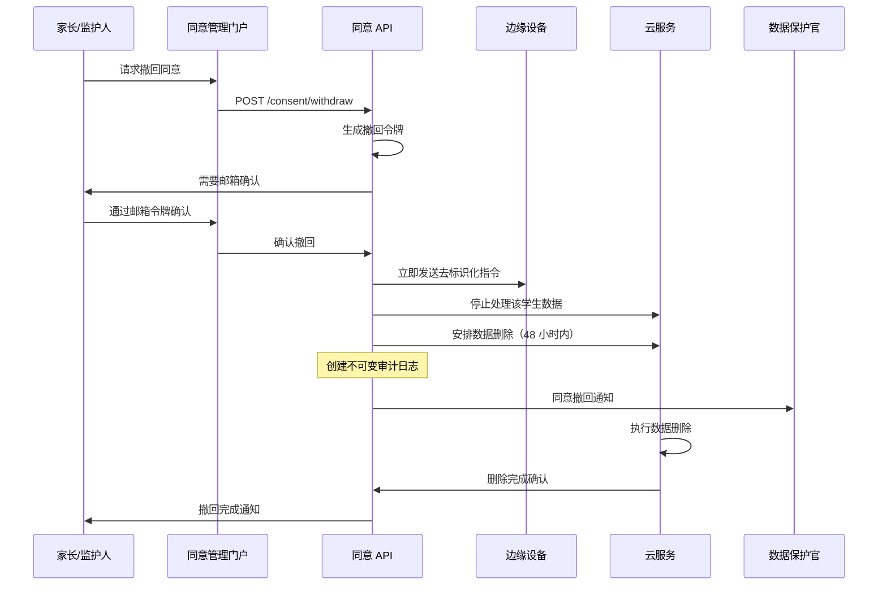

# Privacy Compliance & Data Lifecycle

## Data Lifecycle Overview

please view privacy-compliance.png
```mermaid
flowchart TD
    Collection[ 数据收集<br/>音视频 + 学习管理系统 (LMS) 数据 ]
    Consent[ 同意验证<br/>家长/监护人批准 ]
    Redaction[ 隐私去标识化<br/>移除未同意对象 ]
    Processing[ 特征提取<br/>边缘 + 云端处理 ]
    Storage[ 分层存储<br/>热 → 温 → 冷 ]
    Retention[ 保留管理<br/>自动化删除 ]
    Rights[ 数据主体权利<br/>访问 / 可携带 / 删除 ]
    
    Collection --> Consent
    Consent -->|已同意| Processing
    Consent -->|已拒绝| Redaction
    Redaction --> Processing
    Processing --> Storage
    Storage --> Retention
    Rights --> Storage
    Rights --> Retention
    
    %% 隐私控制
    Collection -.->|隐私设计原则| Consent
    Processing -.->|数据最小化| Storage
    Storage -.->|自动化策略| Retention
```

## 数据分类与保留策略

| 数据类型         | 分类等级 | 保留期限 | 存储层级            | 法律依据           |
| ------------ | ---- | ---- | --------------- | -------------- |
| **原始音视频流**   | 高度敏感 | 30 天 | 热存储（边缘 + S3）    | FERPA 紧急情况例外条款 |
| **处理后的特征数据** | 敏感   | 1 年  | 温存储（PostgreSQL） | 教育用途           |
| **告警元数据**    | 敏感   | 3 年  | 温存储（PostgreSQL） | 安全事件追踪         |
| **审计日志**     | 敏感   | 7 年  | 冷存储（S3 Glacier） | 法规合规           |
| **匿名化分析数据**  | 聚合   | 5 年  | 冷存储（ClickHouse） | 系统优化           |
| **同意记录**     | 法律   | 10 年 | 冷存储（不可变）        | 法律合规           |
| **员工操作记录**   | 内部   | 3 年  | 温存储（PostgreSQL） | 人力资源合规         |

---

### Automated Retention Policies

```yaml
# S3 Lifecycle Policies
evidence_clips:
  transitions:
    - days: 7
      storage_class: STANDARD_IA
    - days: 30  
      storage_class: GLACIER
    - days: 90
      storage_class: DEEP_ARCHIVE
  expiration: 
    days: 365  # After 1 year, move to compliance archive

audit_logs:
  transitions:
    - days: 30
      storage_class: GLACIER
  expiration:
    days: 2555  # 7 years retention

analytics_data:
  transitions:
    - days: 90
      storage_class: STANDARD_IA 
    - days: 365
      storage_class: GLACIER
  expiration:
    days: 1825  # 5 years retention
```

## Consent Management Framework

### Consent Types & Granularity

```json
{
  "consent_record": {
    "student_id": "STU-12345",
    "guardian_id": "GRD-67890", 
    "consent_date": "2024-03-01T00:00:00Z",
    "expiration_date": "2025-02-28T23:59:59Z",
    "consent_version": "v2.1",
    "granular_permissions": {
      "video_monitoring": {
        "granted": true,
        "scope": ["safety_detection", "incident_evidence"]
      },
      "audio_monitoring": {
        "granted": true,
        "scope": ["distress_detection", "bullying_detection"]
      },
      "text_analysis": {
        "granted": false,
        "scope": []
      },
      "data_sharing": {
        "granted": false,
        "scope": []
      }
    },
    "withdrawal_method": "email_portal",
    "notification_preferences": {
      "incidents": true,
      "system_updates": false,
      "research_participation": false
    }
  }
}
```

### Consent Withdrawal Process

please check privacy-compliance1.png


## 隐私影响评估（PIA）检查清单

### 数据最小化

* [x] 仅在上课时间（7:00–18:00）收集音视频数据，特殊区域采用行为模式分析（排徊检测）
* [x] 对未获得同意的个人自动进行人脸/语音去标识化，支持家长分级授权机制（可选择性屏蔽子女画面）
* [x] 特征提取在保留安全信号的同时去除个人身份信息（PII），支持ResNet3D动作分析、微表情AU4/AU7识别
* [x] 不长期存储原始生物特征标识符
* [x] 仅存储用于系统优化的压缩、匿名化分析数据

### 同意管理

* [x] 每年收集家长/监护人同意，并提供明确的退出机制
* [x] 细粒度同意选项（视频、音频、文本分析可单独选择）
* [x] 通过自助门户轻松撤回同意
* [x] 对 13 岁及以上学生提供适龄通知
* [x] 自动化同意到期与续期提醒

### 目的限制

* [x] 数据仅用于即时安全检测
* [x] 不进行学业表现监控或行为评估
* [x] 不用于营销、商业用途或第三方数据销售
* [x] 对执法机构数据请求有明确书面政策
* [x] 对员工进行适当用途限制的培训

### 安全与访问控制

* [x] 数据静态与传输中均使用 AES-256 加密（TLS 1.3+）
* [x] 基于角色的访问控制（RBAC）并遵循最小权限原则
* [x] 所有管理访问均需多因素认证（MFA）
* [x] 定期进行渗透测试与漏洞评估
* [x] 为所有数据访问与操作生成不可变审计日志

### 数据主体权利（GDPR/CCPA）

* [x] 提供家长/学生使用的自助数据访问门户
* [x] 自动化导出机器可读的 JSON 格式数据
* [x] 在 30 天内执行删除权请求
* [x] 以标准化格式提供数据可携带性
* [x] 提供多语言的透明隐私政策

### 跨境数据传输

* [x] 对欧盟数据处理实施标准合同条款（SCCs）
* [x] 为敏感司法辖区提供数据本地化选项
* [x] 定期监测充分性决定的变化
* [x] 遵循具有约束力的公司规则（BCR）合规框架
* [x] 对国际数据传输进行影响评估

---

## Data Protection by Design Implementation

### Technical Safeguards

#### 1. On-Device Privacy Processing
```yaml
edge_privacy_controls:
  face_detection:
    model: "RetinaFace lightweight"
    accuracy: 99.2%
    processing_time: <50ms
    redaction_method: "gaussian_blur + face_replacement"
    
  voice_redaction:  
    method: "spectral_masking + pitch_shifting"
    preservation: "emotional_features_only"
    pii_removal: "speaker_diarization + anonymization"
    
  consent_lookup:
    cache_duration: 300s  # 5 minute local cache
    offline_fallback: "deny_by_default"
    sync_frequency: "real_time"
```

#### 2. Homomorphic Encryption for Cloud Processing
```yaml
encryption_pipeline:
  library: "Microsoft SEAL v4.0"
  scheme: "BFV (Brakerski-Fan-Vercauteren)"
  security_level: 128_bit
  
  operations_supported:
    - "feature_vector_addition"
    - "weighted_sum_computation" 
    - "threshold_comparison"
    - "statistical_aggregation"
    
  performance:
    encryption_overhead: "2.3x processing time"
    accuracy_preservation: ">99.5%"
    key_rotation: "monthly_automated"
```

#### 3. Differential Privacy for Analytics
```yaml
differential_privacy:
  epsilon: 1.0  # Privacy budget
  delta: 1e-6   # Failure probability
  
  mechanisms:
    counting_queries: "Laplace_mechanism"
    histogram_queries: "Exponential_mechanism"
    statistical_releases: "Gaussian_mechanism"
    
  budget_allocation:
    daily_reports: 0.1_epsilon
    weekly_trends: 0.3_epsilon
    monthly_analysis: 0.6_epsilon
```

### Procedural Safeguards

#### Privacy Review Process
please check Privacy-compliance2.png
flowchart LR
    Design[系统设计] --> Review[隐私评审]
    Review --> Legal[法律审查]
    Legal --> DPO[数据保护官审批]
    DPO --> Implement[实施部署]
    Implement --> Audit[隐私审计]
    Audit --> Monitor[持续监控]
    Monitor --> Review

#### Staff Training & Certification
- **初始培训**：8 小时的隐私与数据保护课程
- **年度再认证**：4 小时的更新培训
- **基于角色的培训**：针对不同访问级别的专项培训
- **事件响应**：每季度进行一次数据泄露模拟演练
- **合规测试**：定期进行知识考核

## Privacy Incident Response Plan

### Classification & Response Times

| Severity Level | Examples | Response Time | Notification Required |
|----------------|----------|---------------|----------------------|
| **Critical** | Data breach affecting >500 students | 1 hour | DPO, Legal, Regulators |
| **High** | Unauthorized access to PII | 4 hours | DPO, Legal, School district |
| **Medium** | Consent processing error | 24 hours | DPO, Privacy team |
| **Low** | Minor data quality issue | 72 hours | Privacy team only |

### Response Team Structure
- **Privacy Officer**: Overall incident coordination
- **Legal Counsel**: Regulatory notification requirements  
- **Technical Lead**: Immediate containment actions
- **Communications**: Stakeholder notification
- **External**: Forensics partner (if needed)

### Breach Notification Templates
```
主题: \[紧急] 隐私事件通知 - 学生安全平台

尊敬的 \[教育总监/数据保护官]：

我们在此通知您，学生安全监控平台于 \[日期] 发生了一起隐私事件。

事件概要：

* 性质：\[未经授权的访问 / 数据泄露 / 系统入侵]
* 范围：\[受影响的学生人数]
* 涉及数据类型：\[涉及的数据类别]
* 发现方式：\[事件发现途径]

已采取的紧急措施：

* \[遏制措施]
* \[系统隔离 / 关停]
* \[密码重置 / 撤销访问权限]

风险评估：

* 潜在危害可能性：\[低 / 中 / 高]
* 缓解因素：\[加密 / 去标识化 / 访问控制]

后续步骤：

* 已启动取证调查
* 在 72 小时内通知受影响的个人
* 按要求向监管机构通报
* 加强系统安全措施

我们对此事件高度重视，并将在整个调查过程中保持透明。

联系人：\[隐私官联系信息]

```

## Data Subject Rights Portal

### 自助服务功能

* **访问请求**：下载与学生相关的全部数据
* **更正**：申请修正不准确的数据
* **删除**：申请删除所有学生数据
* **数据可携带性**：以机器可读格式导出数据
* **反对处理**：对特定目的的数据处理提出异议
* **限制处理**：暂时停止数据处理

### Automated Fulfillment
```yaml
rights_automation:
  access_requests:
    fulfillment_time: "within_48_hours"
    format: "JSON + PDF summary"
    delivery: "secure_download_link"
    
  erasure_requests:
    verification_required: "email_confirmation"
    fulfillment_time: "within_30_days"  
    scope: "all_systems_including_backups"
    confirmation: "deletion_certificate"
    
  portability_requests:
    format: "structured_JSON"
    includes: "metadata + evidence_links"
    delivery: "encrypted_download"
```

This comprehensive privacy compliance framework ensures the Student Safety Platform meets the highest standards for data protection while enabling critical safety monitoring capabilities.

## 摄像头部署密度（基于实际调研数据）

### 技术规范
- 教室采用 400 万像素广角镜头（覆盖角度 ≥ 110°）  
- 走廊安装具备 WDR 功能的筒机（动态范围 ≥ 120dB）  
- 夜间区域采用红外 + 白光双补光（有效距离 ≥ 30 米）
- 支持振动模式识别算法、次声波特征库匹配
- Legal-BERT压迫指数模型、图神经网络关联历史事件

### 部署密度标准
- 教学楼走廊：每层 8-12 台（间距 < 15 米）
- 食堂操作间：关键点位 100% 覆盖
- 操场/体育馆：每 400㎡ 1 台（全景 + 特写）
- 实验室：每室 2-3 台（重点设备聚焦）
- 学生宿舍：仅走廊/楼梯间安装（每层 ≥ 4 台）
- 卫生间周边：监控相邻通道（距离 > 3 米），采用行为模式分析替代直接监控

### 五大核心监测场景技术指标
1. **考场压力崩溃**：手部颤抖频率 > 3Hz、皱眉强度 > 0.8、心率 > 100BPM
2. **群体孤立霸凌**：座位排斥率 > 80%、社交平台恶意话题、群体排斥行为
3. **厕所自残干预**：隔间门振动模式、次声波特征匹配、异常握持姿势
4. **教师语言暴力**：贬低词频监测、学生微表情识别、权力压迫指数 > 0.854
5. **网络溯源追踪**：匿名账号行为分析、元数据提取、键入节奏生物特征库