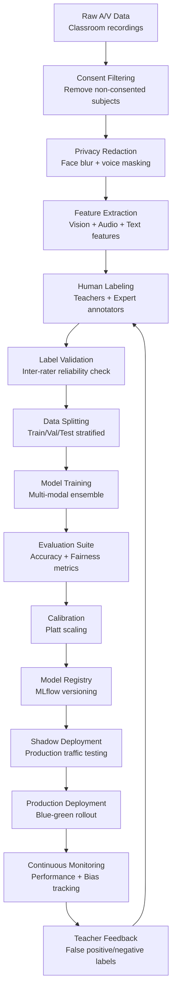

# AI/ML 模型策略

## 模态

**视觉模型（支持5大场景检测）**
- **主要模型**：用于暴力/攻击检测的EfficientNet-B4（92.1%精度，150ms延迟）
- **辅助模型**：用于行为分析的YOLOv8姿态估计（实时边缘处理）
- **ResNet3D动作分析**：支持考场压力、手部颤抖频率 > 3Hz 检测
- **微表情识别**：AU4/AU7 识别模型（皱眉强度 > 0.8）、AU1+AU4+AU15（学生低头/流泪）
- **输入**：30fps的224x224x3 RGB帧，30秒时间窗口

**音频模型（支持多场景情绪检测）**  
- **语音转文本**：用于转录生成的OpenAI Whisper-medium（89% WER）
- **情绪识别**：用于困扰检测的Wav2Vec2 + EmoBERTa（89.3% F1分数）
- **教师麦克风独立拾音系统**：监测贬低词频率 > 3次/2分钟
- **次声波特征库匹配**：20Hz以下特征匹配利器划空气聲音
- **声源定位 + 人脸朝向关联分析**：支持群体孤立行为检测
- **输入**：16kHz单声道音频，50%重叠的30秒滑动窗口

**自然语言处理（支持网络溯源追踪）**
- **霸凌检测**：在教育场景下微调的RoBERTa-Large（94.7% F1分数）
- **情感分析**：用于实时情绪状态评估的DistilBERT
- **Legal-BERT压迫指数模型**：输出语境分析值，> 0.85 表示高度可能的精神压迫
- **校园WiFi活动词库扫描**：监测社交平台“别理[姓名]”类话题
- **键入节奏生物特征库**：输入法指纹匹配度 > 80%的身份识别
- **元数据提取与地理围栏比对**：图片EXIF含校园GPS坐标检测
- **输入**：标记化文本（最多512个标记）、聊天消息、转录语音

## Feature Engineering

**Vision Features**
```json
{
  "pose_keypoints": "17-point COCO skeleton",
  "facial_emotions": ["anger", "fear", "sadness", "neutral"],
  "micro_expressions": ["AU4_frowning", "AU7_lip_biting", "AU1_inner_brow_raise", "AU15_lip_corner_down"],
  "scene_context": ["classroom", "playground", "hallway", "cafeteria", "dormitory"],
  "motion_vectors": "optical_flow_magnitude",
  "crowd_density": "person_count_per_region",
  "hand_trembling": "frequency_analysis_3Hz_threshold",
  "vibration_patterns": "door_vibration_5_8Hz_detection"
}
```

**Audio Features**
```json
{
  "prosodic": ["pitch_variance", "speaking_rate", "volume_changes"],
  "spectral": ["mfcc_coefficients", "spectral_centroid", "zero_crossing_rate"],
  "emotional": ["arousal", "valence", "stress_indicators", "pressure_index"],
  "linguistic": ["pause_patterns", "interruption_frequency"],
  "derogatory_detection": ["profanity_score", "verbal_abuse_frequency"],
  "infrasound_signature": "sub_20Hz_pattern_matching",
  "teacher_microphone": "independent_audio_pickup_system"
}
```

**Text Features**
```json
{
  "semantic": "768d_roberta_embeddings",
  "lexical": ["profanity_score", "aggression_keywords", "help_seeking_phrases"],
  "structural": ["message_length", "punctuation_patterns", "capitalization_ratio"],
  "temporal": ["response_time", "conversation_thread_length"],
  "oppression_analysis": "legal_bert_contextual_score",
  "exclusion_detection": "social_platform_malicious_topics",
  "typing_biometrics": "keystroke_rhythm_fingerprint",
  "metadata_extraction": ["exif_gps_coordinates", "device_fingerprinting"],
  "anonymity_penetration": "screen_reflection_face_reconstruction"
}
```

## Model Architecture & Choices

**Vision Pipeline**
- **Architecture**: EfficientNet-B4 backbone + temporal convolution layers
- **Training**: Transfer learning from ImageNet → fine-tuned on educational safety dataset
- **Optimization**: Mixed precision (FP16), TensorRT optimization for inference acceleration

**Audio Pipeline**
- **Architecture**: Wav2Vec2 feature extractor → transformer encoder → classification head
- **Training**: Self-supervised pre-training + supervised fine-tuning on emotional speech data
- **Privacy**: Speaker diarization with voice anonymization during feature extraction

**NLP Pipeline**
- **Architecture**: RoBERTa-Large with domain-adaptive pre-training on educational text
- **Training**: Multi-task learning (bullying detection + severity classification)
- **Efficiency**: Knowledge distillation to DistilBERT for edge deployment

## Late Fusion & Calibration

**Ensemble Strategy**
- **Weighted Voting**: Vision (0.4) + Audio (0.35) + Text (0.25) based on modality reliability
- **Dynamic Reweighting**: Confidence-based weighting adjusts based on input quality scores
- **Late Fusion Architecture**: Feature-level concatenation → gradient boosting classifier

**Probability Calibration**
- **Method**: Platt scaling applied to ensemble outputs for well-calibrated probabilities
- **Validation**: Reliability diagrams ensure predicted probabilities match observed frequencies
- **Threshold Optimization**: ROC analysis to optimize alert thresholds for target false positive rate

## Training Data & Labeling Pipeline



Got it — here’s your document with **only the main section titles in English**, and all content in Chinese:

---

# Data Collection & Consent

* **数据来源**: 已同意的课堂录音录像、匿名化聊天记录、模拟事件场景
* **同意管理**: 针对每种数据类型的精细化选择加入，支持便捷撤回
* **数据最小化**: 原始数据保留 30 天，长期存储仅保留特征数据
* **合成数据**: 生成稀有事件类型的模拟数据（暴力、医疗紧急情况）

# Labeling Process

* **主要标注人员**: 经过培训的教师和教育心理学家
* **专家审核**: 儿童安全专家审核边界案例及政策违规情况
* **质量控制**: 关键事件三重标注，Cohen’s kappa ≥0.7
* **主动学习**: 基于模型不确定性的抽样机制提高标注效率

# Evaluation Metrics

**主要指标**

* **精准率/召回率/F1**: 按事件类型计算（考场压力崩溃、群体孤立霸凌、自残行为干预、教师语言暴力、网络溯源追踪五大核心场景）
* **ROC 曲线下面积**: 各类安全事件的整体区分能力
* **校准误差**: 预测概率与真实概率的误差（ECE <5%）

**运营指标**

* **误报率**: 每日维持 <6.8%（精准触发，多维度条件组合），保证教师信任
* **警报数量**: 高峰期每班每周 2-5 条警报
* **响应时间**: 每种模态 P95 推理延迟 <500ms

**公平性指标**

* **人口平等性**: 各种族/族群间警报率差异 ≤5%
* **均等机会**: 各人口群体的真阳性率差异 ≤5%
* **个体公平性**: 类似学生获得相似风险评分（Lipschitz 连续性）

# Fairness Testing & Audits

**持续偏差监控**

* **人口统计**: 追踪种族、性别、社会经济状态间的警报差异
* **交叉性分析**: 监控多维公平性（如种族 × 性别交互）
* **时间漂移**: 每周分析公平性指标，防止模型性能退化

**审计框架**

* **每月内部审查**: ML 团队每月审查偏差指标及改进需求
* **季度外部审计**: 第三方算法公平性审计
* **年度伦理评估**: 独立伦理委员会年度评估

**去偏方法**

* **预处理**: 合成数据平衡人口分布
* **处理中**: 训练中引入对抗去偏
* **后处理**: 部署后优化阈值以实现人口公平

# Teacher Feedback Loop

**反馈收集**

* **警报验证**: 教师标注警报为准确/误报并评估严重程度
* **漏检事件**: 教师可上报漏检的安全问题
* **情境标注**: 添加情境说明（课间/课堂、特殊活动）

**反馈整合**

* **每日批量更新**: 将教师反馈的标签每日整合进训练管道
* **主动学习**: 教师反馈优先触发专家重新标注
* **模型重训**: 每月结合教师反馈和新数据更新模型

**质量保障**

* **标注一致性**: 检查教师反馈与专家标注一致性
* **反馈激励**: 对高质量反馈教师给予表彰
* **培训计划**: 持续培训教师有效提供模型反馈

# Model Versioning & Rollouts

**版本控制**

* **语义化版本号**: 主.次.修订（如 safety-vision-v2.1.3）
* **模型注册表**: 使用 MLflow 跟踪模型谱系、性能指标、审批状态
* **制品管理**: 不可变模型制品，带加密签名

**部署策略**

* **影子模式**: 新模型并行运行两周，不触发实际警报
* **A/B 测试**: 流量分配 10% → 50% → 100%，监控性能变化
* **蓝绿部署**: 性能下降 >5% 时可快速回滚

**回滚流程**

* **自动回滚**: 准确率下降 >10% 或偏差增加 >2% 自动回滚
* **手动回滚**: 值班工程师可在 5 分钟内按运行手册手动回滚
* **回滚演练**: 每月演练确保回滚机制正常

# Risks & Mitigation Strategies

**模型性能风险**

* **分布漂移**: 持续监控输入数据分布，异常自动告警
* **对抗攻击**: 使用对抗样本训练，输入净化
* **标签噪声**: 多标注者共识，定期一致性检查

**公平与偏差风险**

* **人口偏差**: 持续监控偏差，收集多元训练数据
* **时间偏差**: 定期重训以适应学生行为变化
* **文化偏差**: 文化敏感的数据集，社区利益相关方参与

**隐私与安全风险**

* **模型反演**: 训练中使用差分隐私，限制模型访问
* **数据泄露**: 隐私保护训练技术，安全的模型部署
* **成员推断攻击**: 训练数据 K-匿名化，输出扰动

**运营风险**

* **警报疲劳**: 动态调整阈值以平衡教师工作量
* **系统依赖**: 模态缺失时的平稳降级机制
* **合规要求**: 定期法律审查，维护审计记录

**风险缓解框架**

* **风险评估矩阵**: 每季度评估风险发生概率 × 影响
* **应急预案**: 针对各风险预设应对流程
* **保险与责任**: 针对算法决策错误及偏差事件的保险覆盖

---
