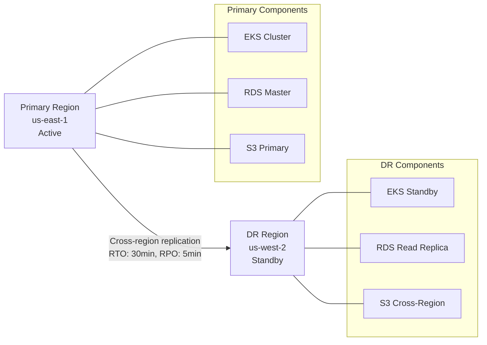
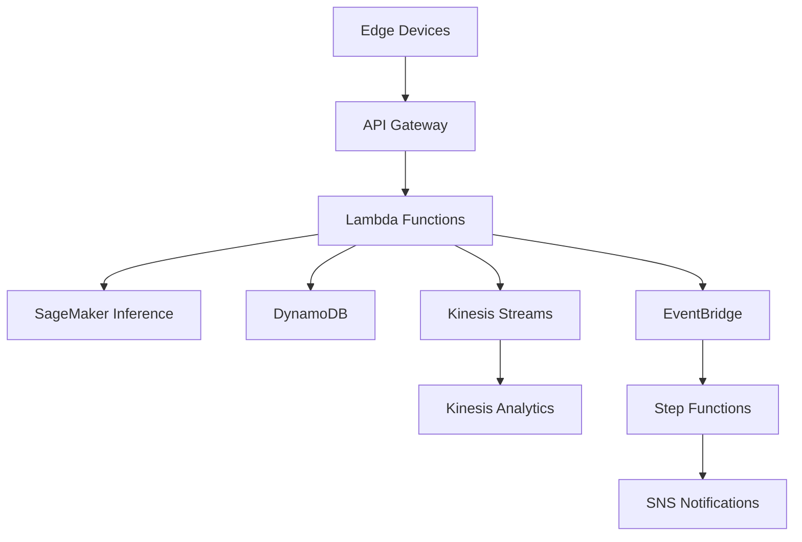

# Deployment Topology & Infrastructure

## Deployment Architecture

Please check deployment.png
```mermaid
graph TB
    subgraph "Classroom Edge (Per Room)"
        EdgeDev[Jetson Orin NX<br/>32GB RAM, 1024 CUDA cores<br/>WiFi 6, PoE+]
        EdgeCam[IP Camera<br/>4K 30fps, H.265]
        EdgeMic[Ceiling Mic Array<br/>6-channel, noise cancel]
    end
    
    subgraph "School VPC (Per School)"
        EdgeGW[Edge Gateway<br/>Aggregator + VPN]
        SchoolFW[School Firewall<br/>Deep packet inspection]
        SchoolNet[School Network<br/>VLAN isolation]
    end
    
    subgraph "Primary Cloud Region (us-east-1)"
        subgraph "API Gateway Layer"
            ALB[Application Load Balancer<br/>TLS 1.3 termination]
            APIGW[API Gateway<br/>Rate limiting, RBAC]
        end
        
        subgraph "Compute Layer"
            K8s[EKS Cluster<br/>Multi-AZ deployment]
            GPU[GPU Node Pool<br/>p3.2xlarge (V100)<br/>Auto-scaling 2-20 nodes]
            CPU[CPU Node Pool<br/>m5.xlarge<br/>Auto-scaling 5-50 nodes]
        end
        
        subgraph "Streaming Layer"
            Kafka[MSK Kafka<br/>3 brokers, multi-AZ<br/>Encryption in transit/rest]
            Connect[Kafka Connect<br/>Source/Sink connectors]
        end
        
        subgraph "Storage Layer"
            Redis[ElastiCache Redis<br/>Cluster mode, 6 shards<br/>Hot data, sessions]
            PG[RDS PostgreSQL 14<br/>Multi-AZ, read replicas<br/>Encrypted, automated backups]
            S3Hot[S3 Standard<br/>Evidence clips, logs<br/>30-day lifecycle]
            ClickHouse[ClickHouse Cloud<br/>Time-series analytics<br/>Compressed metrics]
        end
        
        subgraph "AI/ML Services"
            ModelReg[Model Registry<br/>MLflow tracking]
            Inference[Inference Services<br/>TensorFlow Serving<br/>Auto-scaling]
            Training[Training Pipeline<br/>SageMaker, spot instances]
        end
    end
    
    subgraph "DR Region (us-west-2)"
        DRK8s[EKS Standby<br/>Cross-region replication]
        DRS3[S3 Cross-Region<br/>Automated failover]
        DRPG[RDS Cross-Region<br/>Read replica]
    end
    
    subgraph "External Services"
        SSO[Google Workspace SSO<br/>SAML 2.0, SCIM]
        LMS[Google Classroom API<br/>OAuth 2.0, webhook]
        SMS[Twilio SMS API<br/>Delivery receipts]
        Email[SendGrid SMTP<br/>TLS encryption]
    end
    
    %% Connections
    EdgeCam --> EdgeDev
    EdgeMic --> EdgeDev
    EdgeDev --> EdgeGW
    EdgeGW --> SchoolFW
    SchoolFW --> SchoolNet
    SchoolNet --> ALB
    
    ALB --> APIGW
    APIGW --> K8s
    K8s --> GPU
    K8s --> CPU
    K8s --> Redis
    K8s --> PG
    K8s --> Kafka
    
    Kafka --> Connect
    Connect --> ClickHouse
    GPU --> Inference
    Inference --> ModelReg
    
    K8s --> S3Hot
    S3Hot --> DRS3
    PG --> DRPG
    K8s --> DRK8s
    
    K8s --> SSO
    K8s --> LMS
    K8s --> SMS
    K8s --> Email
    
    %% Data flow annotations
    EdgeDev -.->|Encrypted streams<br/>10-20 Mbps| SchoolNet
    SchoolNet -.->|TLS 1.3<br/>Certificate pinning| ALB
    GPU -.->|Model inference<br/>300-1500ms| Inference
    Kafka -.->|Real-time events<br/>50k msgs/sec| Connect
```

## Infrastructure Components

### 边缘硬件规格

**摄像头部署密度**（基于实际调研数据）：

| 区域类型 | 安装密度 | 功能定位 | 典型场景 | 智能分析功能 |
|----------|----------|----------|----------|-------------|
| 教学楼走廊 | 每层 8-12 台（间距 < 15 米） | 学生行为轨迹追踪 + 紧急事件响应 | 课间追逐摔倒预警（响应 < 5 秒）、欺凌行为识别（检出率 91%） | 异常行为识别（跌倒/奔跑/聚集） |
| 教室内部 | 每室 1 台（后墙高位安装） | 教学秩序监控 + 考场压力监测 | 多媒体设备异常移动报警、手部颤抖频率 > 3Hz 检测 | 压力指数计算、微表情 AU4/AU7 识别 |
| 食堂操作间 | 关键点位 100% 覆盖 | 食品安全监控 + 座位排斥率分析 | 未戴手套操作识别（准确率 99%）、午餐座位排斥率 > 80% | 食堂轨迹跟踪算法 |
| 操场/体育馆 | 每 400㎡ 1 台（全景 + 特写） | 运动安全监测 + 群体事件预警 | 足球碰撞伤害预判（提前 1.2 秒报警）、突发聚集识别（>50 人集群检测） | 运动伤害预判 + 设施损坏检测 |
| 实验室 | 每室 2-3 台（重点设备聚焦） | 危险操作监管 + 设备安全 | 危化品违规取用识别（准确率 97%）、明火异常检测（响应 < 3 秒） | 危险操作监管 |
| 学生宿舍 | 仅走廊/楼梯间安装（每层 ≥ 4 台） | 夜间安全管控 + 人员进出管理 | 晚归学生记录（22:00 后）、可疑人员尾随预警 | 热力图人流统计 + 滞留预警 |

**硬件规格表**：

| 组件    | 型号                    | 规格                            | 每间教室数量 | 成本    |
| ----- | --------------------- | ----------------------------- | ------ | ----- |
| 边缘计算机 | NVIDIA Jetson Orin NX | 32GB 内存，1024 CUDA 核心，100 TOPS | 1      | \$599 |
| 网络摄像机 | Axis P1375-E          | 4K 30帧/秒，H.265，PoE+，夜视功能，400万像素广角镜头（覆盖角度 ≥ 110°）      | 1–2    | \$299 |
| 麦克风阵列 | Shure MXA310          | 6通道天花板安装，降噪功能                 | 1      | \$899 |
| 网络交换机 | Ubiquiti UniFi        | 8口 PoE+，可管理，1Gb 上行            | 1      | \$179 |

### Cloud Infrastructure

#### Compute Resources
```yaml
# Kubernetes Node Groups
gpu_nodes:
  instance_type: p3.2xlarge  # 1x V100, 8 vCPU, 61GB RAM
  min_size: 2
  max_size: 20
  desired_size: 4
  
cpu_nodes:
  instance_type: m5.xlarge   # 4 vCPU, 16GB RAM
  min_size: 5
  max_size: 50
  desired_size: 10

# Auto-scaling Policies
scale_up_threshold: 70%    # GPU/CPU utilization
scale_down_threshold: 30%
cooldown_period: 300s
```

#### Storage Configuration
```yaml
# Redis Cluster (Hot Storage)
elasticache_redis:
  node_type: cache.r6g.xlarge
  num_cache_clusters: 6
  multi_az: true
  encryption_in_transit: true
  encryption_at_rest: true

# PostgreSQL (Warm Storage)  
rds_postgresql:
  instance_class: db.r5.2xlarge
  engine_version: "14.9"
  multi_az: true
  backup_retention_period: 7
  encryption: true

# S3 Storage (Cold Storage)
s3_buckets:
  evidence_clips:
    storage_class: STANDARD
    lifecycle_policy: 30_day_retention
  audit_logs:
    storage_class: GLACIER
    lifecycle_policy: 7_year_retention
```

#### Kafka Streaming
```yaml
# MSK (Managed Streaming for Kafka)
kafka_cluster:
  instance_type: kafka.m5.xlarge
  num_brokers: 3
  availability_zones: 3
  encryption_in_transit: TLS
  encryption_at_rest: true
  
topics:
  safety_alerts:
    partitions: 12
    replication_factor: 3
    retention_ms: 604800000  # 7 days
  safety_actions:
    partitions: 6 
    replication_factor: 3
    retention_ms: 2592000000 # 30 days
```

## Network Architecture

### Edge-to-Cloud Connectivity
```
Classroom Edge Device (Jetson)
├── Local WiFi 6 (802.11ax)
├── Ethernet Backup (Gigabit)
└── Cellular Failover (5G/LTE)

School Network
├── VLAN Segmentation (IoT devices isolated)
├── Firewall (pfSense/Fortinet)
├── VPN Tunnel (WireGuard to cloud)
└── Bandwidth: 100Mbps+ per school
```

### 安全层级

1. **设备层**：TPM 2.0 安全启动、基于证书的身份验证
2. **网络层**：VPN 隧道、证书绑定、DPI 防火墙
3. **应用层**：mTLS、基于角色的访问控制（RBAC）、API 速率限制
4. **数据层**：AES-256 静态与传输加密

## Disaster Recovery & High Availability

### Multi-Region Strategy
please check deployment1.png


### 可用性目标

* **教室设备**：99.0%（允许单个设备故障）
* **校园网络**：99.5%（冗余互联网连接）
* **云基础设施**：99.9%（多可用区部署）
* **整体系统**：在上课时间（上午 7 点 - 下午 6 点）保持 99.5%

### Backup & Recovery
```yaml
backup_strategy:
  databases:
    frequency: continuous_wal + daily_full
    retention: 30_days_point_in_time
    recovery_time: under_15_minutes
    
  evidence_files:
    frequency: real_time_cross_region
    retention: per_data_policy
    recovery_time: under_5_minutes
    
  configurations:
    frequency: on_change + daily_snapshot
    retention: 90_days
    recovery_time: under_30_minutes
```

## Alternate Architecture: Serverless Deployment

For smaller deployments (<20 schools, <1000 classrooms), consider a serverless architecture:
please check deployment2.png


### 无服务器组件

* **API Gateway**：REST 接口、WebSocket 连接
* **Lambda**：事件处理、业务逻辑（15 分钟超时）
* **SageMaker**：无服务器机器学习模型推理
* **DynamoDB**：支持自动扩展的 NoSQL 存储
* **Kinesis**：实时流式分析
* **EventBridge**：事件路由与调度

### 与容器部署的权衡

| 方面       | 容器（EKS）   | 无服务器        |
| -------- | --------- | ----------- |
| **成本**   | 固定成本、批量折扣 | 按请求计费，无空闲成本 |
| **延迟**   | 稳定 <100ms | 冷启动可能 1-5 秒 |
| **扩展性**  | 手动配置      | 自动、无限扩展     |
| **复杂度**  | 运维开销较高    | 运维更简单       |
| **厂商锁定** | 平台无关      | 依赖 AWS      |
| **监控**   | 完全可控      | 可观测性有限      |

**建议**：在试点部署和小型学区使用无服务器架构；规模超过 5000 间教室时迁移到容器化生产环境。
