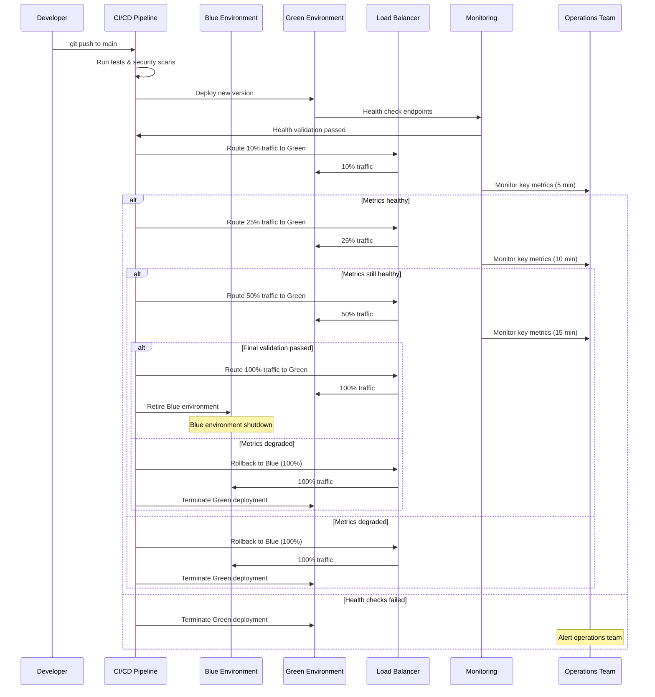

# Operations & DevOps

## Environment Strategy

**开发环境（dev）**

* **用途**：个人开发者功能测试、单元测试验证，支持五大核心场景测试
* **基础设施**：单区域（us-east-1），最小计算资源，仅使用合成数据
* **数据**：匿名化测试数据集，无真实学生数据，无需同意的测试环境
* **访问**：所有开发人员可访问，无需审批，自助部署

**预发布测试环境（staging）**

* **用途**：集成测试、QA 验证、预生产冒烟测试，涵盖考场压力、霸凌检测等场景验证
* **基础设施**：接近生产的部署架构但缩小规模（2 个可用区，减少实例数量）
* **数据**：已去除 PII 的生产类数据，模拟真实流量模式
* **访问**：QA 团队、技术负责人，部署需 PR 审批

**预生产环境（pre-prod）**

* **用途**：上线前最终验证、压力测试、安全验证，包括误报率<6.8%的目标验证
* **基础设施**：与生产环境完全一致的拓扑与配置，独立 DNS
* **数据**：生产数据子集，严格访问控制，完全符合隐私合规要求
* **访问**：站点可靠性工程师，部署需技术负责人 + 安全团队批准

**生产环境（prod）**

* **用途**：在所有参与学校进行实时学生安全监控，精准触发五大核心场景
* **基础设施**：多区域（主 + 灾备），自动伸缩，99.5% 可用性 SLA
* **数据**：完整学生数据，配备全套隐私控制与审计日志
* **访问**：仅限值班工程师，需遵循变更管理流程

---

## CI/CD 流水线

**构建阶段**

* **代码质量**：使用 ESLint、black（Python）、go fmt 保持格式一致性
* **单元测试**：Jest（JavaScript）、pytest（Python），覆盖率至少 85%
* **静态分析**：SonarQube 进行代码质量、复杂度分析与可维护性评分
* **依赖检查**：npm audit、pip-audit 检查已知漏洞

**安全扫描**

* **SAST**：Semgrep 静态代码分析，定制隐私违规规则
* **容器扫描**：Trivy 检测基础镜像漏洞，执行自定义安全策略
* **密钥检测**：GitLeaks 扫描凭证，pre-commit 钩子强制检查
* **基础设施安全**：Checkov 校验 Terraform 合规性，验证 CIS 基准

**测试与验证**

* **集成测试**：API 合同测试、数据库迁移验证
* **端到端测试**：Cypress 测试 UI 流程，Postman 测试 API
* **性能测试**：K6 压力测试，延迟回归检测
* **隐私测试**：自动化同意验证、数据流合规性验证


## Blue-Green Deployment Flow

Please check operations.png


## Infrastructure as Code

**Terraform 管理**

* **状态管理**：使用 S3 远程状态存储与 DynamoDB 锁定，每个环境单独的 state 文件
* **模块结构**：VPC、EKS、RDS、安全组等可复用模块并进行版本化管理
* **变更验证**：所有更改必须执行 `terraform plan`，自动化漂移检测
* **审批流程**：使用 Terragrunt 进行环境特定配置，生产环境需人工审批

**Kubernetes 配置**

* **Helm Charts**：通过 Helm 管理应用部署，使用环境特定的 values 文件
* **GitOps**：使用 ArgoCD 持续部署，Git 作为唯一事实来源
* **资源管理**：配置资源配额（Resource Quotas）、限制范围（Limit Ranges）、Pod 中断预算（Pod Disruption Budgets）
* **安全策略**：配置 Pod 安全策略、网络策略、RBAC 访问控制

**Configuration Management**
```yaml
environments:
  dev:
    replicas: 1
    resources: {cpu: "100m", memory: "128Mi"}
    auto_scaling: false
  staging: 
    replicas: 2
    resources: {cpu: "500m", memory: "512Mi"}
    auto_scaling: true
  prod:
    replicas: 5
    resources: {cpu: "2000m", memory: "4Gi"}
    auto_scaling: true
    min_replicas: 3
    max_replicas: 50
```

## Secrets Management

**Vault 集成**

* **HashiCorp Vault**：作为主要机密存储，支持动态生成密钥
* **Kubernetes 集成**：使用 Vault Agent 注入器实现密钥自动挂载
* **轮换策略**：数据库凭证与 API 密钥每 90 天自动轮换
* **访问控制**：基于路径的访问策略，限时令牌

**密钥类别**

* **数据库凭证**：自动轮换连接字符串，支持读写分离
* **API 密钥**：外部服务凭证（短信、邮件、SSO 提供商）
* **加密密钥**：用于数据加密的 AES-256 密钥，支持密钥版本管理
* **证书**：通过 Let’s Encrypt 或内部 CA 自动续期的 TLS 证书

**Developer Experience**
```bash
# Local development secret access
vault auth -method=oidc
vault read secret/dev/database/postgres

# CI/CD pipeline secret injection
vault write auth/kubernetes/role/ci-cd \
  bound_service_account_names=ci-cd \
  policies=ci-cd-policy \
  ttl=15m
```

## Observability Integration

**监控栈**（参考 nfr-monitoring.md）

* **指标采集**：使用 Prometheus 并配备自定义导出器，采集隐私与安全相关指标
* **分布式追踪**：使用 Jaeger 进行端到端请求追踪，支持关联 ID
* **日志聚合**：ELK 栈，采用结构化 JSON 日志，隐私敏感字段脱敏
* **告警**：AlertManager 路由至 PagerDuty，集成 Slack 进行团队通知

**自定义指标仪表板**

* **部署指标**：构建成功率、部署频率、交付周期
* **系统健康**：各环境的服务可用性、错误率、响应时间
* **业务指标**：告警生成率、误报率、教师参与度
* **成本追踪**：资源利用率、按服务划分的云成本、每位学生的监控成本

## 值班与运行手册

**值班轮换**

* **排班模式**：Follow-the-sun 模式，保证主值班与副值班覆盖
* **升级处理**：15 分钟无响应自动升级，P0 事件需经理介入
* **工具**：PagerDuty 进行告警，Slack 用于协作，Zoom 用于事件通话
* **交接**：每日站会更新事件状态，每周进行事后回顾


**Runbook Library**
- **[High Latency Debugging](https://wiki.company.com/runbooks/high-latency)**: Performance investigation, database query optimization, cache troubleshooting
- **[Privacy Incident Response](https://wiki.company.com/runbooks/privacy-incident)**: Breach containment, notification procedures, forensics collection
- **[Failed Deployment Recovery](https://wiki.company.com/runbooks/deployment-failure)**: Blue-green rollback, database migration rollback, service restoration
- **[Model Performance Issues](https://wiki.company.com/runbooks/model-performance)**: Accuracy degradation investigation, model rollback procedures

**事件管理**

* **分类**：P0/P1/P2/P3，不同等级对应明确的响应时间与升级处理流程
* **战情室**：专用 Slack 渠道、指定事件指挥官、定期向相关方更新进展
* **沟通**：状态页更新，P0/P1 级别主动通知家长与学校
* **事后处理**：72 小时内完成无责事后分析，跟踪改进行动项

---

## 备份与灾难恢复

**备份策略**

* **数据库备份**：持续 WAL-E 流式传输、每日全量备份、保留 30 天
* **证据存储**：实时跨区域复制，合规数据保留 7 年
* **配置备份**：每日备份 GitOps 仓库与基础设施状态快照
* **应用数据**：每日生成 Redis 缓存快照，备份用户会话数据

**恢复测试**

* **每月演练**：验证数据库恢复与配置恢复
* **每季度演练**：完整灾难恢复场景，包括跨区域故障切换
* **年度评估**：审查完整业务连续性计划，验证 RTO/RPO 指标
* **文档**：逐步恢复操作手册与紧急联系人信息

**Recovery Procedures**
```yaml
database_recovery:
  rto_target: "15_minutes"
  procedure:
    - "Switch DNS to DR region"  
    - "Promote read replica to primary"
    - "Update application connection strings"
    - "Validate data integrity"
    
application_recovery:
  rto_target: "30_minutes"
  procedure:
    - "Deploy from last known good image"
    - "Restore configuration from backup"
    - "Run health checks"
    - "Gradual traffic restoration"
```

## Cost Management & Guardrails

**预算控制**

* **月度预算**：\$120,000/月，设定 20% 偏差告警阈值
* **资源限制**：自动伸缩上限，每个环境的最大实例数限制
* **成本分摊**：按团队、环境、功能进行标签标记，用于成本回收费
* **优化措施**：自动化资源优化建议，使用抢占式实例节省成本

**成本监控**

* **实时追踪**：集成 AWS Cost Explorer，每日发送支出通知
* **预测分析**：趋势分析用于容量规划与季节性调整建模
* **异常检测**：自动告警异常支出模式与资源使用峰值
* **报告机制**：按服务生成每周成本报告，按月对比预算与实际支出

**资源优化**

* **自动伸缩**：根据需求动态伸缩，对可预测负载进行计划伸缩
* **预留实例**：1 年期基准容量预留，节省约 30% 成本
* **抢占式实例**：用于训练任务、批处理作业，节省 60–70% 成本
* **资源清理**：自动删除未使用资源，检测孤立卷

---

## 发布管理与节奏

**发布计划**

* **主要版本**：每季度发布新功能版本，可能包含重大变更
* **次要版本**：每两周发布一次，包含修复、性能优化与安全更新
* **热修复**：针对严重漏洞与关键错误的紧急发布
* **模型更新**：每月进行一次机器学习模型再训练与部署，支持 A/B 测试

**变更管理**

* **变更审批**：生产环境变更需技术评审，基础设施变更需安全评审
* **维护窗口**：安排在非上课时间（18:00–6:00）
* **沟通机制**：计划维护提前 48 小时通知，实时更新状态
* **回滚标准**：自动化回滚触发条件，手动回滚决策矩阵

**Release Quality Gates**
```yaml
quality_gates:
  security:
    - "SAST scan passed"
    - "Container vulnerabilities < HIGH"
    - "No hardcoded secrets detected"
  performance:
    - "Load test passed (p95 < 3s)"  
    - "No memory leaks detected"
    - "Database migration < 30s"
  privacy:
    - "Privacy test suite passed"
    - "Consent flow validation"
    - "Data retention policy verified"
```

**Feature Flags**
- **Gradual Rollouts**: Feature flags for progressive feature enablement
- **Kill Switches**: Emergency feature disabling without deployment
- **A/B Testing**: User-based feature toggling for experimentation
- **Environment Consistency**: Same feature flag state across all environments