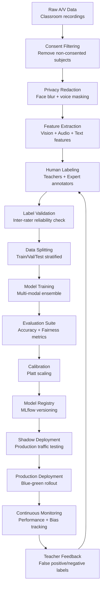

# AI/ML Model Strategy

## Modalities

**Vision Models**
- **Primary**: EfficientNet-B4 for violence/aggression detection (92.1% accuracy, 150ms latency)
- **Secondary**: YOLOv8 pose estimation for behavioral analysis (real-time edge processing)
- **Input**: 224x224x3 RGB frames at 30fps, 30-second temporal windows

**Audio Models**  
- **Speech-to-Text**: OpenAI Whisper-medium for transcript generation (89% WER)
- **Emotion Recognition**: Wav2Vec2 + EmoBERTa for distress detection (89.3% F1 score)
- **Input**: 16kHz mono audio, 30-second sliding windows with 50% overlap

**Natural Language Processing**
- **Bullying Detection**: RoBERTa-Large fine-tuned on educational contexts (94.7% F1 score)
- **Sentiment Analysis**: DistilBERT for real-time emotional state assessment
- **Input**: Tokenized text (max 512 tokens), chat messages, transcribed speech

## Feature Engineering

**Vision Features**
```json
{
  "pose_keypoints": "17-point COCO skeleton",
  "facial_emotions": ["anger", "fear", "sadness", "neutral"],
  "scene_context": ["classroom", "playground", "hallway"],
  "motion_vectors": "optical_flow_magnitude",
  "crowd_density": "person_count_per_region"
}
```

**Audio Features**
```json
{
  "prosodic": ["pitch_variance", "speaking_rate", "volume_changes"],
  "spectral": ["mfcc_coefficients", "spectral_centroid", "zero_crossing_rate"],
  "emotional": ["arousal", "valence", "stress_indicators"],
  "linguistic": ["pause_patterns", "interruption_frequency"]
}
```

**Text Features**
```json
{
  "semantic": "768d_roberta_embeddings",
  "lexical": ["profanity_score", "aggression_keywords", "help_seeking_phrases"],
  "structural": ["message_length", "punctuation_patterns", "capitalization_ratio"],
  "temporal": ["response_time", "conversation_thread_length"]
}
```

## Model Architecture & Choices

**Vision Pipeline**
- **Architecture**: EfficientNet-B4 backbone + temporal convolution layers
- **Training**: Transfer learning from ImageNet → fine-tuned on educational safety dataset
- **Optimization**: Mixed precision (FP16), TensorRT optimization for inference acceleration

**Audio Pipeline**
- **Architecture**: Wav2Vec2 feature extractor → transformer encoder → classification head
- **Training**: Self-supervised pre-training + supervised fine-tuning on emotional speech data
- **Privacy**: Speaker diarization with voice anonymization during feature extraction

**NLP Pipeline**
- **Architecture**: RoBERTa-Large with domain-adaptive pre-training on educational text
- **Training**: Multi-task learning (bullying detection + severity classification)
- **Efficiency**: Knowledge distillation to DistilBERT for edge deployment

## Late Fusion & Calibration

**Ensemble Strategy**
- **Weighted Voting**: Vision (0.4) + Audio (0.35) + Text (0.25) based on modality reliability
- **Dynamic Reweighting**: Confidence-based weighting adjusts based on input quality scores
- **Late Fusion Architecture**: Feature-level concatenation → gradient boosting classifier

**Probability Calibration**
- **Method**: Platt scaling applied to ensemble outputs for well-calibrated probabilities
- **Validation**: Reliability diagrams ensure predicted probabilities match observed frequencies
- **Threshold Optimization**: ROC analysis to optimize alert thresholds for target false positive rate

## Training Data & Labeling Pipeline



**Data Collection & Consent**
- **Sources**: Consented classroom recordings, anonymized chat logs, simulated incident scenarios
- **Consent Management**: Granular opt-in for each modality, easy withdrawal process
- **Data Minimization**: 30-day raw data retention, feature-only long-term storage
- **Synthetic Data**: Generated scenarios to augment rare incident types (violence, medical emergencies)

**Labeling Process**
- **Primary Annotators**: Trained teachers and educational psychologists
- **Expert Review**: Child safety specialists for edge cases and policy violations  
- **Quality Control**: Triple annotation for critical incidents, Cohen's kappa ≥0.7 requirement
- **Active Learning**: Model uncertainty-based sampling for efficient annotation

## Evaluation Metrics

**Primary Metrics**
- **Precision/Recall/F1**: Per incident type (bullying, violence, distress, medical emergency)
- **Area Under ROC**: Overall discriminative performance across all safety categories
- **Calibration Error**: Expected vs observed probability accuracy (target <5% ECE)

**Operational Metrics**
- **False Positive Rate**: <10% to maintain teacher trust (measured daily)
- **Alert Volume**: Target 2-5 alerts per classroom per week during peak activity
- **Response Time**: P95 inference latency <500ms per modality

**Fairness Metrics**
- **Demographic Parity**: Alert rates should not vary >5% across racial/ethnic groups
- **Equalized Odds**: True positive rates balanced across demographics within 5%
- **Individual Fairness**: Similar students receive similar risk scores (Lipschitz continuity)

## Fairness Testing & Audits

**Continuous Bias Monitoring**
- **Demographics**: Track alert disparity across race, gender, socioeconomic status
- **Intersectionality**: Monitor multi-dimensional fairness (e.g., race × gender interactions)
- **Temporal Drift**: Weekly analysis of fairness metrics to detect model degradation

**Audit Framework**
- **Monthly Internal Review**: ML team analyzes bias metrics and remediation needs
- **Quarterly External Audit**: Third-party algorithmic fairness assessment
- **Annual Ethics Review**: Independent ethics board evaluates overall system fairness

**Bias Mitigation Techniques**
- **Pre-processing**: Synthetic data generation to balance demographic representation
- **In-processing**: Adversarial debiasing during training to remove protected attribute signals
- **Post-processing**: Threshold optimization to achieve demographic parity post-deployment

## Teacher Feedback Loop

**Feedback Collection**
- **Alert Validation**: Teachers mark alerts as accurate/false positive with severity assessment
- **Missed Incidents**: Teachers can report undetected safety concerns for model improvement
- **Context Annotation**: Additional situational context (recess vs classroom time, special events)

**Feedback Integration**
- **Daily Batch Updates**: False positive/negative labels incorporated into training pipeline
- **Active Learning**: Teacher feedback prioritizes which incidents need expert re-annotation
- **Model Retraining**: Monthly model updates incorporating teacher feedback and new data

**Quality Assurance**
- **Inter-rater Reliability**: Regular checks between teacher feedback and expert annotations
- **Feedback Incentives**: Recognition system for teachers providing high-quality feedback
- **Training Programs**: Ongoing education for teachers on effective model feedback

## Model Versioning & Rollouts

**Version Control**
- **Semantic Versioning**: Major.Minor.Patch (e.g., safety-vision-v2.1.3)
- **Model Registry**: MLflow tracking with model lineage, performance metrics, and approval status
- **Artifact Management**: Immutable model artifacts with cryptographic signatures

**Deployment Strategy**
- **Shadow Mode**: New models run in parallel for 2 weeks without generating alerts
- **A/B Testing**: Gradual traffic splitting (10% → 50% → 100%) with performance monitoring
- **Blue-Green Deployment**: Instant rollback capability if performance degrades >5%

**Rollback Procedures**
- **Automated Rollback**: Triggered by accuracy drop >10% or bias increase >2%
- **Manual Rollback**: On-call engineer can revert within 5 minutes via runbook
- **Rollback Testing**: Monthly drill to ensure rollback procedures function correctly

## Risks & Mitigation Strategies

**Model Performance Risks**
- **Distribution Drift**: Continuous monitoring of input data distributions, automatic alerts when drift detected
- **Adversarial Attacks**: Robust training with adversarial examples, input sanitization
- **Label Noise**: Multi-annotator consensus, regular inter-rater reliability assessment

**Fairness & Bias Risks**  
- **Demographic Bias**: Continuous bias monitoring, diverse training data collection
- **Temporal Bias**: Regular model retraining to adapt to changing student behaviors
- **Cultural Bias**: Culturally-aware training data, community stakeholder input

**Privacy & Security Risks**
- **Model Inversion**: Differential privacy during training, limited model access
- **Data Leakage**: Privacy-preserving training techniques, secure model serving infrastructure
- **Membership Inference**: K-anonymity in training data, output perturbation

**Operational Risks**
- **Alert Fatigue**: Dynamic threshold adjustment based on teacher feedback and workload
- **System Dependencies**: Graceful degradation when modalities unavailable
- **Regulatory Compliance**: Regular legal review of model decisions, audit trail maintenance

**Mitigation Framework**
- **Risk Assessment Matrix**: Quarterly evaluation of likelihood × impact for each risk category
- **Contingency Planning**: Pre-defined response procedures for each identified risk scenario
- **Insurance & Liability**: Coverage for algorithmic decision-making errors and bias incidents