# System Architecture

## Logical Architecture Diagram

```mermaid
flowchart TD
    %% Data Sources
    Cam[📹 Classroom Cameras] 
    Mic[🎤 Classroom Microphones]
    LMS[📚 LMS/Chat Systems]
    
    %% Edge Layer
    Edge[🔹 Classroom Edge Node<br/>Jetson/NUC]
    
    %% Privacy Gates
    Consent[🛡️ Consent Check]
    Redact[🔒 Face/Voice Redaction]
    
    %% Feature Extraction
    VisionFE[👁️ Vision Features<br/>Pose, Gesture, Scene]
    AudioFE[🔊 Audio Features<br/>Emotion, Stress, Volume]
    TextFE[📝 Text Features<br/>Sentiment, Toxicity]
    
    %% Cloud Inference
    VisionAI[🧠 Vision Model<br/>Violence Detection]
    AudioAI[🧠 Audio Model<br/>Distress Detection]
    NLPAI[🧠 NLP Model<br/>Bullying Detection]
    
    %% Fusion & Scoring
    Fusion[⚖️ Late Fusion<br/>Risk Scoring]
    
    %% Alerting
    Alert[🚨 Alert Engine]
    Dedup[🔄 Deduplication]
    
    %% Human Workflow
    Teacher[👩‍🏫 Teacher Dashboard]
    Counselor[👨‍💼 Counselor Portal]
    Admin[👩‍💼 Admin Panel]
    
    %% Storage
    Hot[🔥 Hot Storage<br/>Redis/MemDB]
    Warm[📦 Warm Storage<br/>PostgreSQL]
    Cold[❄️ Cold Storage<br/>S3/GCS]
    
    %% Data Flow
    Cam --> Edge
    Mic --> Edge
    LMS --> Edge
    
    Edge --> Consent
    Consent -->|Consented| VisionFE
    Consent -->|Non-Consented| Redact
    Redact --> VisionFE
    
    Edge --> AudioFE
    LMS --> TextFE
    
    VisionFE -->|Encrypted| VisionAI
    AudioFE -->|Encrypted| AudioAI
    TextFE -->|Encrypted| NLPAI
    
    VisionAI --> Fusion
    AudioAI --> Fusion
    NLPAI --> Fusion
    
    Fusion -->|Risk > Threshold| Alert
    Alert --> Dedup
    
    Dedup --> Teacher
    Dedup --> Counselor
    Dedup --> Admin
    
    Teacher --> Hot
    Counselor --> Warm
    Admin --> Cold
    
    %% Audit Trail
    Alert --> Audit[📋 Audit Log]
    Teacher --> Audit
    Counselor --> Audit
```

## End-to-End Incident Flow

```mermaid
flowchart TD
    Start([🎬 Incident Occurs<br/>Classroom 205A]) 
    
    Capture[📹 Camera/Mic Capture<br/>t+0ms]
    
    EdgeProcess[🔹 Edge Processing<br/>t+100-300ms<br/>• Consent lookup<br/>• Face/voice redaction<br/>• Feature extraction]
    
    CloudInfer[☁️ Cloud Inference<br/>t+500-1500ms<br/>• Vision: Violence score 0.85<br/>• Audio: Distress score 0.78<br/>• Fusion: Risk score 0.82]
    
    RiskCheck{Risk ≥ 0.75?}
    
    AlertGen[🚨 Alert Generation<br/>t+1800ms<br/>• Alert ID: ALT-205A-20240315-1432<br/>• Priority: HIGH<br/>• Evidence: Video clip + transcript]
    
    Dedup[🔄 Deduplication<br/>t+1900ms<br/>Check last 60s for similar alerts]
    
    Notify[📱 Real-time Notification<br/>t+2000ms<br/>• WebSocket push to Teacher<br/>• SMS to Counselor<br/>• Email to Admin]
    
    TeacherAck[👩‍🏫 Teacher Acknowledgment<br/>t+3-15min<br/>• Views evidence<br/>• Assesses situation<br/>• Takes action]
    
    Resolution{Resolution?}
    
    Document[📝 Incident Documentation<br/>• Resolution notes<br/>• Follow-up actions<br/>• Student welfare check]
    
    AuditLog[📋 Audit Trail<br/>• All actions logged<br/>• Immutable timestamps<br/>• Compliance reporting]
    
    DataRetention[🗂️ Data Lifecycle<br/>• Raw A/V: 30-day retention<br/>• Features: 1-year retention<br/>• Audit: 7-year retention]
    
    NoAlert[✅ No Alert Generated<br/>Continue monitoring]
    
    Escalate[⚠️ Escalation<br/>Auto-escalate if no ack in 15min]
    
    Start --> Capture
    Capture --> EdgeProcess
    EdgeProcess --> CloudInfer
    CloudInfer --> RiskCheck
    
    RiskCheck -->|Yes| AlertGen
    RiskCheck -->|No| NoAlert
    
    AlertGen --> Dedup
    Dedup --> Notify
    Notify --> TeacherAck
    
    TeacherAck --> Resolution
    Resolution -->|Resolved| Document
    Resolution -->|No Response| Escalate
    
    Escalate --> Document
    Document --> AuditLog
    AuditLog --> DataRetention
```

## Real-time Alerting Sequence

## Data Processing Pipeline

### Edge Processing (Classroom Level)
- **Input**: Raw A/V streams (4K 30fps, 6-channel audio)
- **Consent Check**: Real-time lookup against consent database
- **Privacy Redaction**: Face detection + voice spectral masking
- **Feature Extraction**: Lightweight pose detection, audio features
- **Bandwidth**: 90% reduction through edge preprocessing

### Cloud Inference (Regional Level)  
- **Vision Pipeline**: EfficientNet-B4 for violence/aggression detection
- **Audio Pipeline**: Wav2Vec2 + EmoBERTa for emotion recognition
- **Text Pipeline**: RoBERTa-Large for bullying classification
- **Late Fusion**: Weighted ensemble with confidence calibration

### Storage Tiers
1. **Hot (Redis)**: Active alerts, user sessions, real-time cache
2. **Warm (PostgreSQL)**: Alert metadata, user data, analytics
3. **Cold (S3/Glacier)**: Raw evidence, long-term audit logs

## Key Design Decisions

### Privacy-First Architecture
- **Edge-centric processing**: Minimizes data leaving classroom
- **Consent-driven redaction**: Non-consented subjects automatically obscured
- **Homomorphic encryption**: Secure computation on encrypted features
- **Data minimization**: Aggressive retention policies

### Scalability & Performance
- **Horizontal scaling**: Auto-scaling Kubernetes deployments
- **GPU optimization**: Batch inference with dynamic scaling
- **Caching layers**: Multi-tier caching for sub-second responses
- **Event-driven**: Kafka streaming for real-time processing

### Reliability & Monitoring
- **Multi-region deployment**: Active-active with automatic failover
- **Circuit breakers**: Prevent cascade failures
- **Comprehensive monitoring**: APM, metrics, logs, traces
- **Chaos engineering**: Regular failure simulation testing