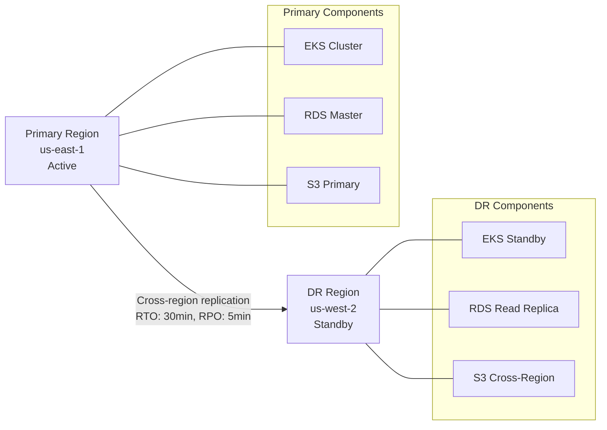
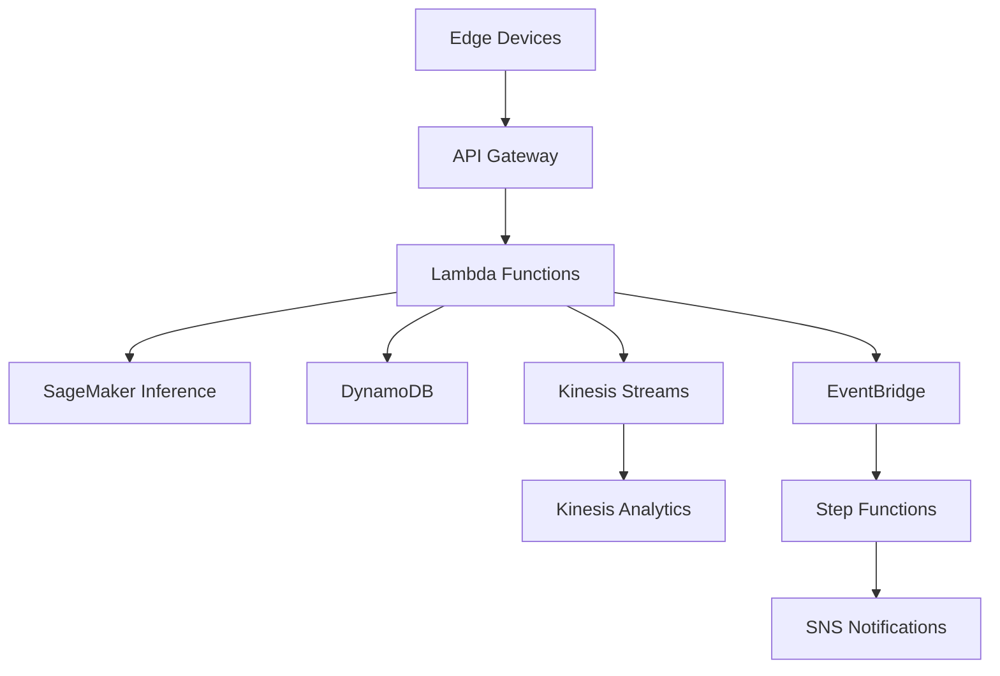

# Deployment Topology & Infrastructure

## Deployment Architecture

```mermaid
graph TB
    subgraph "Classroom Edge (Per Room)"
        EdgeDev[Jetson Orin NX<br/>32GB RAM, 1024 CUDA cores<br/>WiFi 6, PoE+]
        EdgeCam[IP Camera<br/>4K 30fps, H.265]
        EdgeMic[Ceiling Mic Array<br/>6-channel, noise cancel]
    end
    
    subgraph "School VPC (Per School)"
        EdgeGW[Edge Gateway<br/>Aggregator + VPN]
        SchoolFW[School Firewall<br/>Deep packet inspection]
        SchoolNet[School Network<br/>VLAN isolation]
    end
    
    subgraph "Primary Cloud Region (us-east-1)"
        subgraph "API Gateway Layer"
            ALB[Application Load Balancer<br/>TLS 1.3 termination]
            APIGW[API Gateway<br/>Rate limiting, RBAC]
        end
        
        subgraph "Compute Layer"
            K8s[EKS Cluster<br/>Multi-AZ deployment]
            GPU[GPU Node Pool<br/>p3.2xlarge (V100)<br/>Auto-scaling 2-20 nodes]
            CPU[CPU Node Pool<br/>m5.xlarge<br/>Auto-scaling 5-50 nodes]
        end
        
        subgraph "Streaming Layer"
            Kafka[MSK Kafka<br/>3 brokers, multi-AZ<br/>Encryption in transit/rest]
            Connect[Kafka Connect<br/>Source/Sink connectors]
        end
        
        subgraph "Storage Layer"
            Redis[ElastiCache Redis<br/>Cluster mode, 6 shards<br/>Hot data, sessions]
            PG[RDS PostgreSQL 14<br/>Multi-AZ, read replicas<br/>Encrypted, automated backups]
            S3Hot[S3 Standard<br/>Evidence clips, logs<br/>30-day lifecycle]
            ClickHouse[ClickHouse Cloud<br/>Time-series analytics<br/>Compressed metrics]
        end
        
        subgraph "AI/ML Services"
            ModelReg[Model Registry<br/>MLflow tracking]
            Inference[Inference Services<br/>TensorFlow Serving<br/>Auto-scaling]
            Training[Training Pipeline<br/>SageMaker, spot instances]
        end
    end
    
    subgraph "DR Region (us-west-2)"
        DRK8s[EKS Standby<br/>Cross-region replication]
        DRS3[S3 Cross-Region<br/>Automated failover]
        DRPG[RDS Cross-Region<br/>Read replica]
    end
    
    subgraph "External Services"
        SSO[Google Workspace SSO<br/>SAML 2.0, SCIM]
        LMS[Google Classroom API<br/>OAuth 2.0, webhook]
        SMS[Twilio SMS API<br/>Delivery receipts]
        Email[SendGrid SMTP<br/>TLS encryption]
    end
    
    %% Connections
    EdgeCam --> EdgeDev
    EdgeMic --> EdgeDev
    EdgeDev --> EdgeGW
    EdgeGW --> SchoolFW
    SchoolFW --> SchoolNet
    SchoolNet --> ALB
    
    ALB --> APIGW
    APIGW --> K8s
    K8s --> GPU
    K8s --> CPU
    K8s --> Redis
    K8s --> PG
    K8s --> Kafka
    
    Kafka --> Connect
    Connect --> ClickHouse
    GPU --> Inference
    Inference --> ModelReg
    
    K8s --> S3Hot
    S3Hot --> DRS3
    PG --> DRPG
    K8s --> DRK8s
    
    K8s --> SSO
    K8s --> LMS
    K8s --> SMS
    K8s --> Email
    
    %% Data flow annotations
    EdgeDev -.->|Encrypted streams<br/>10-20 Mbps| SchoolNet
    SchoolNet -.->|TLS 1.3<br/>Certificate pinning| ALB
    GPU -.->|Model inference<br/>300-1500ms| Inference
    Kafka -.->|Real-time events<br/>50k msgs/sec| Connect
```

## Infrastructure Components

### Edge Hardware Specifications

| Component | Model | Specifications | Quantity per Classroom | Cost |
|-----------|-------|----------------|----------------------|------|
| Edge Computer | NVIDIA Jetson Orin NX | 32GB RAM, 1024 CUDA cores, 100 TOPS | 1 | $599 |
| IP Camera | Axis P1375-E | 4K 30fps, H.265, PoE+, night vision | 1-2 | $299 |
| Microphone Array | Shure MXA310 | 6-channel ceiling mount, noise cancellation | 1 | $899 |
| Network Switch | Ubiquiti UniFi | 8-port PoE+, managed, 1Gb uplink | 1 | $179 |

### Cloud Infrastructure

#### Compute Resources
```yaml
# Kubernetes Node Groups
gpu_nodes:
  instance_type: p3.2xlarge  # 1x V100, 8 vCPU, 61GB RAM
  min_size: 2
  max_size: 20
  desired_size: 4
  
cpu_nodes:
  instance_type: m5.xlarge   # 4 vCPU, 16GB RAM
  min_size: 5
  max_size: 50
  desired_size: 10

# Auto-scaling Policies
scale_up_threshold: 70%    # GPU/CPU utilization
scale_down_threshold: 30%
cooldown_period: 300s
```

#### Storage Configuration
```yaml
# Redis Cluster (Hot Storage)
elasticache_redis:
  node_type: cache.r6g.xlarge
  num_cache_clusters: 6
  multi_az: true
  encryption_in_transit: true
  encryption_at_rest: true

# PostgreSQL (Warm Storage)  
rds_postgresql:
  instance_class: db.r5.2xlarge
  engine_version: "14.9"
  multi_az: true
  backup_retention_period: 7
  encryption: true

# S3 Storage (Cold Storage)
s3_buckets:
  evidence_clips:
    storage_class: STANDARD
    lifecycle_policy: 30_day_retention
  audit_logs:
    storage_class: GLACIER
    lifecycle_policy: 7_year_retention
```

#### Kafka Streaming
```yaml
# MSK (Managed Streaming for Kafka)
kafka_cluster:
  instance_type: kafka.m5.xlarge
  num_brokers: 3
  availability_zones: 3
  encryption_in_transit: TLS
  encryption_at_rest: true
  
topics:
  safety_alerts:
    partitions: 12
    replication_factor: 3
    retention_ms: 604800000  # 7 days
  safety_actions:
    partitions: 6 
    replication_factor: 3
    retention_ms: 2592000000 # 30 days
```

## Network Architecture

### Edge-to-Cloud Connectivity
```
Classroom Edge Device (Jetson)
├── Local WiFi 6 (802.11ax)
├── Ethernet Backup (Gigabit)
└── Cellular Failover (5G/LTE)

School Network
├── VLAN Segmentation (IoT devices isolated)
├── Firewall (pfSense/Fortinet)
├── VPN Tunnel (WireGuard to cloud)
└── Bandwidth: 100Mbps+ per school
```

### Security Layers
1. **Device Level**: TPM 2.0 secure boot, certificate-based auth
2. **Network Level**: VPN tunnels, certificate pinning, DPI firewall
3. **Application Level**: mTLS, RBAC, API rate limiting
4. **Data Level**: AES-256 encryption at rest and in transit

## Disaster Recovery & High Availability

### Multi-Region Strategy


### Availability Targets
- **Classroom Devices**: 99.0% (individual device failures acceptable)
- **School Network**: 99.5% (redundant internet connections)  
- **Cloud Infrastructure**: 99.9% (multi-AZ deployment)
- **Overall System**: 99.5% during school hours (7 AM - 6 PM)

### Backup & Recovery
```yaml
backup_strategy:
  databases:
    frequency: continuous_wal + daily_full
    retention: 30_days_point_in_time
    recovery_time: under_15_minutes
    
  evidence_files:
    frequency: real_time_cross_region
    retention: per_data_policy
    recovery_time: under_5_minutes
    
  configurations:
    frequency: on_change + daily_snapshot
    retention: 90_days
    recovery_time: under_30_minutes
```

## Alternate Architecture: Serverless Deployment

For smaller deployments (<20 schools, <1000 classrooms), consider a serverless architecture:



### Serverless Components
- **API Gateway**: REST endpoints, WebSocket connections
- **Lambda**: Event processing, business logic (15min timeout)
- **SageMaker**: Serverless inference for ML models  
- **DynamoDB**: NoSQL storage with auto-scaling
- **Kinesis**: Real-time streaming analytics
- **EventBridge**: Event routing and scheduling

### Trade-offs vs. Container Deployment

| Aspect | Containers (EKS) | Serverless |
|--------|------------------|------------|
| **Cost** | Fixed costs, volume discounts | Pay-per-request, no idle costs |
| **Latency** | <100ms consistent | 1-5s cold start potential |
| **Scaling** | Manual configuration | Automatic, unlimited |
| **Complexity** | Higher operational overhead | Simpler operations |
| **Vendor Lock-in** | Platform agnostic | AWS specific |
| **Monitoring** | Full control | Limited observability |

**Recommendation**: Use serverless for pilot deployments and smaller districts; migrate to containers for production scale (>5000 classrooms).