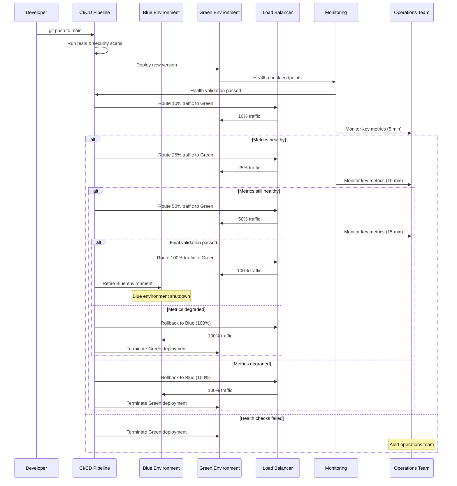

# Operations & DevOps

## Environment Strategy

**Development (dev)**
- **Purpose**: Individual developer feature testing, unit test validation
- **Infrastructure**: Single-region (us-east-1), minimal compute resources, synthetic data only
- **Data**: Anonymized test datasets, no real student data, consent-free testing environment
- **Access**: All developers, no approval required, self-service deployment

**Staging (staging)**
- **Purpose**: Integration testing, QA validation, pre-production smoke tests
- **Infrastructure**: Production-like setup but scaled down (2 AZs, reduced instance counts)
- **Data**: Sanitized production-like data with PII removed, realistic traffic patterns
- **Access**: QA team, tech leads, requires PR approval for deployments

**Pre-Production (pre-prod)**
- **Purpose**: Final validation before production, load testing, security verification
- **Infrastructure**: Full production topology, identical configuration, separate DNS
- **Data**: Production data subset with strict access controls, full privacy compliance
- **Access**: Site reliability engineers, deployment approval required from tech lead + security

**Production (prod)**
- **Purpose**: Live student safety monitoring across all participating schools
- **Infrastructure**: Multi-region (primary + DR), auto-scaling, 99.5% availability SLA
- **Data**: Full student data with complete privacy controls, audit logging
- **Access**: On-call engineers only, change management process required

## CI/CD Pipeline

**Build Stage**
- **Code Quality**: ESLint, black (Python), go fmt for formatting consistency
- **Unit Tests**: Jest (JavaScript), pytest (Python), minimum 85% coverage requirement
- **Static Analysis**: SonarQube for code quality, complexity analysis, maintainability scoring
- **Dependency Check**: npm audit, pip-audit for known vulnerability scanning

**Security Scanning**
- **SAST**: Semgrep for static code analysis, custom rules for privacy violations
- **Container Scanning**: Trivy for base image vulnerabilities, custom security policies
- **Secret Detection**: GitLeaks for credential scanning, pre-commit hooks
- **Infrastructure Security**: Checkov for Terraform compliance, CIS benchmark validation

**Testing & Validation**
- **Integration Tests**: API contract testing, database migration validation
- **End-to-End Tests**: Cypress for UI workflows, Postman for API testing
- **Performance Tests**: K6 load testing, latency regression detection
- **Privacy Tests**: Automated consent verification, data flow validation

## Blue-Green Deployment Flow



## Infrastructure as Code

**Terraform Management**
- **State Management**: S3 remote state with DynamoDB locking, separate state files per environment
- **Module Structure**: Reusable modules for VPC, EKS, RDS, security groups with versioning
- **Validation**: terraform plan required for all changes, automated drift detection
- **Approval Process**: Terragrunt for environment-specific configurations, manual approval for prod

**Kubernetes Configuration**
- **Helm Charts**: Application deployments managed via Helm with environment-specific values
- **GitOps**: ArgoCD for continuous deployment, Git as single source of truth
- **Resource Management**: Resource quotas, limit ranges, pod disruption budgets configured
- **Security Policies**: Pod security policies, network policies, RBAC configurations

**Configuration Management**
```yaml
environments:
  dev:
    replicas: 1
    resources: {cpu: "100m", memory: "128Mi"}
    auto_scaling: false
  staging: 
    replicas: 2
    resources: {cpu: "500m", memory: "512Mi"}
    auto_scaling: true
  prod:
    replicas: 5
    resources: {cpu: "2000m", memory: "4Gi"}
    auto_scaling: true
    min_replicas: 3
    max_replicas: 50
```

## Secrets Management

**Vault Integration**
- **HashiCorp Vault**: Primary secrets store with dynamic secret generation
- **Kubernetes Integration**: Vault Agent injector for automatic secret mounting
- **Rotation Policy**: Automatic 90-day rotation for database credentials, API keys
- **Access Control**: Path-based access policies, time-bounded tokens

**Secret Categories**
- **Database Credentials**: Auto-rotated connection strings, read/write separation
- **API Keys**: External service credentials (SMS, email, SSO providers)
- **Encryption Keys**: AES-256 keys for data encryption, key versioning support
- **Certificates**: TLS certificates with automatic renewal via Let's Encrypt/internal CA

**Developer Experience**
```bash
# Local development secret access
vault auth -method=oidc
vault read secret/dev/database/postgres

# CI/CD pipeline secret injection
vault write auth/kubernetes/role/ci-cd \
  bound_service_account_names=ci-cd \
  policies=ci-cd-policy \
  ttl=15m
```

## Observability Integration

**Monitoring Stack** (references nfr-monitoring.md)
- **Metrics Collection**: Prometheus with custom exporters for privacy/safety metrics
- **Distributed Tracing**: Jaeger for end-to-end request tracing, correlation IDs
- **Log Aggregation**: ELK stack with structured JSON logging, privacy-safe field redaction
- **Alerting**: AlertManager routing to PagerDuty, Slack integration for team notifications

**Custom Metrics Dashboard**
- **Deployment Metrics**: Build success rates, deployment frequency, lead time
- **System Health**: Service availability, error rates, response times per environment
- **Business Metrics**: Alert generation rates, false positive percentages, teacher engagement
- **Cost Tracking**: Resource utilization, cloud spend by service, cost per student monitored

## On-Call & Runbooks

**On-Call Rotation**
- **Schedule**: Follow-the-sun model with primary/secondary coverage
- **Escalation**: Automatic escalation after 15 minutes, manager involvement for P0 incidents
- **Tools**: PagerDuty for alerting, Slack for coordination, Zoom for incident calls
- **Handoff**: Daily standup for incident status, weekly retrospectives

**Runbook Library**
- **[High Latency Debugging](https://wiki.company.com/runbooks/high-latency)**: Performance investigation, database query optimization, cache troubleshooting
- **[Privacy Incident Response](https://wiki.company.com/runbooks/privacy-incident)**: Breach containment, notification procedures, forensics collection
- **[Failed Deployment Recovery](https://wiki.company.com/runbooks/deployment-failure)**: Blue-green rollback, database migration rollback, service restoration
- **[Model Performance Issues](https://wiki.company.com/runbooks/model-performance)**: Accuracy degradation investigation, model rollback procedures

**Incident Management**
- **Classification**: P0/P1/P2/P3 with defined response times and escalation procedures
- **War Room**: Dedicated Slack channel, incident commander assignment, stakeholder updates
- **Communication**: Status page updates, proactive parent/school notifications for P0/P1
- **Post-Incident**: Blameless postmortem within 72 hours, action item tracking

## Backup & Disaster Recovery

**Backup Strategy**
- **Database Backups**: Continuous WAL-E streaming, daily full backups, 30-day retention
- **Evidence Storage**: Real-time cross-region replication, 7-year compliance retention
- **Configuration Backups**: Daily GitOps repository backups, infrastructure state snapshots
- **Application Data**: Daily snapshots of Redis cache, user session backups

**Recovery Testing**
- **Monthly Drills**: Database restore validation, configuration recovery testing
- **Quarterly Exercises**: Full disaster recovery scenario, cross-region failover
- **Annual Assessment**: Complete business continuity plan review, RTO/RPO validation
- **Documentation**: Step-by-step recovery procedures, emergency contact information

**Recovery Procedures**
```yaml
database_recovery:
  rto_target: "15_minutes"
  procedure:
    - "Switch DNS to DR region"  
    - "Promote read replica to primary"
    - "Update application connection strings"
    - "Validate data integrity"
    
application_recovery:
  rto_target: "30_minutes"
  procedure:
    - "Deploy from last known good image"
    - "Restore configuration from backup"
    - "Run health checks"
    - "Gradual traffic restoration"
```

## Cost Management & Guardrails

**Budget Controls**
- **Monthly Budget**: $120k/month with 20% variance alerting threshold
- **Resource Limits**: Auto-scaling caps, maximum instance counts per environment
- **Cost Allocation**: Tagging strategy by team, environment, and feature for chargeback
- **Optimization**: Automated rightsizing recommendations, spot instance utilization

**Cost Monitoring**
- **Real-time Tracking**: AWS Cost Explorer integration, daily spend notifications
- **Forecasting**: Trend analysis for capacity planning, seasonal adjustment modeling
- **Anomaly Detection**: Automated alerts for unusual spend patterns, resource usage spikes
- **Reporting**: Weekly cost reports by service, monthly budget vs actual analysis

**Resource Optimization**
- **Auto-scaling**: Dynamic scaling based on demand, scheduled scaling for predictable loads
- **Reserved Instances**: 1-year commitments for baseline capacity, 30% cost savings
- **Spot Instances**: Training workloads, batch processing, 60-70% cost reduction
- **Resource Cleanup**: Automated deletion of unused resources, orphaned volume detection

## Release Management & Cadence

**Release Schedule**
- **Major Releases**: Quarterly feature releases with new capabilities, breaking changes
- **Minor Releases**: Bi-weekly bug fixes, performance improvements, security updates
- **Hotfixes**: Emergency releases for critical bugs, security vulnerabilities
- **Model Updates**: Monthly ML model retraining and deployment, A/B testing

**Change Management**
- **Change Approval**: Technical review for all prod changes, security review for infrastructure
- **Maintenance Windows**: Scheduled during non-school hours (6 PM - 6 AM)
- **Communication**: 48-hour advance notice for planned maintenance, real-time status updates
- **Rollback Criteria**: Automated rollback triggers, manual rollback decision matrix

**Release Quality Gates**
```yaml
quality_gates:
  security:
    - "SAST scan passed"
    - "Container vulnerabilities < HIGH"
    - "No hardcoded secrets detected"
  performance:
    - "Load test passed (p95 < 3s)"  
    - "No memory leaks detected"
    - "Database migration < 30s"
  privacy:
    - "Privacy test suite passed"
    - "Consent flow validation"
    - "Data retention policy verified"
```

**Feature Flags**
- **Gradual Rollouts**: Feature flags for progressive feature enablement
- **Kill Switches**: Emergency feature disabling without deployment
- **A/B Testing**: User-based feature toggling for experimentation
- **Environment Consistency**: Same feature flag state across all environments