# Privacy Compliance & Data Lifecycle

## Data Lifecycle Overview

```mermaid
flowchart TD
    Collection[📹 Data Collection<br/>A/V + LMS data]
    Consent[🛡️ Consent Verification<br/>Parent/Guardian approval]
    Redaction[🔒 Privacy Redaction<br/>Non-consented subjects]
    Processing[⚙️ Feature Extraction<br/>Edge + Cloud processing]
    Storage[💾 Tiered Storage<br/>Hot → Warm → Cold]
    Retention[⏰ Retention Management<br/>Automated deletion]
    Rights[👤 Subject Rights<br/>Access/Portability/Erasure]
    
    Collection --> Consent
    Consent -->|Granted| Processing
    Consent -->|Denied| Redaction
    Redaction --> Processing
    Processing --> Storage
    Storage --> Retention
    Rights --> Storage
    Rights --> Retention
    
    %% Privacy Controls
    Collection -.->|Privacy by Design| Consent
    Processing -.->|Data Minimization| Storage
    Storage -.->|Automated Policies| Retention
```



## Data Classification & Retention

| Data Type | Classification | Retention Period | Storage Tier | Legal Basis |
|-----------|----------------|------------------|--------------|-------------|
| **Raw A/V streams** | Highly Sensitive | 30 days | Hot (Edge + S3) | FERPA emergency exception |
| **Processed features** | Sensitive | 1 year | Warm (PostgreSQL) | Educational purpose |
| **Alert metadata** | Sensitive | 3 years | Warm (PostgreSQL) | Safety incident tracking |
| **Audit logs** | Sensitive | 7 years | Cold (S3 Glacier) | Regulatory compliance |
| **Anonymous analytics** | Aggregated | 5 years | Cold (ClickHouse) | System optimization |
| **Consent records** | Legal | 10 years | Cold (Immutable) | Legal compliance |
| **Staff actions** | Internal | 3 years | Warm (PostgreSQL) | HR compliance |

### Automated Retention Policies

```yaml
# S3 Lifecycle Policies
evidence_clips:
  transitions:
    - days: 7
      storage_class: STANDARD_IA
    - days: 30  
      storage_class: GLACIER
    - days: 90
      storage_class: DEEP_ARCHIVE
  expiration: 
    days: 365  # After 1 year, move to compliance archive

audit_logs:
  transitions:
    - days: 30
      storage_class: GLACIER
  expiration:
    days: 2555  # 7 years retention

analytics_data:
  transitions:
    - days: 90
      storage_class: STANDARD_IA 
    - days: 365
      storage_class: GLACIER
  expiration:
    days: 1825  # 5 years retention
```

## Consent Management Framework

### Consent Types & Granularity

```json
{
  "consent_record": {
    "student_id": "STU-12345",
    "guardian_id": "GRD-67890", 
    "consent_date": "2024-03-01T00:00:00Z",
    "expiration_date": "2025-02-28T23:59:59Z",
    "consent_version": "v2.1",
    "granular_permissions": {
      "video_monitoring": {
        "granted": true,
        "scope": ["safety_detection", "incident_evidence"]
      },
      "audio_monitoring": {
        "granted": true,
        "scope": ["distress_detection", "bullying_detection"]
      },
      "text_analysis": {
        "granted": false,
        "scope": []
      },
      "data_sharing": {
        "granted": false,
        "scope": []
      }
    },
    "withdrawal_method": "email_portal",
    "notification_preferences": {
      "incidents": true,
      "system_updates": false,
      "research_participation": false
    }
  }
}
```

### Consent Withdrawal Process


## Privacy Impact Assessment (PIA) Checklist

### Data Minimization ✅
- [x] Only collect A/V during school hours (7 AM - 6 PM)
- [x] Automatic face/voice redaction for non-consented individuals  
- [x] Feature extraction removes PII while preserving safety signals
- [x] No persistent storage of raw biometric identifiers
- [x] Compressed, anonymized analytics only for system optimization

### Consent Management ✅
- [x] Annual parent/guardian consent with clear opt-out mechanism
- [x] Granular consent options (video, audio, text analysis separate)
- [x] Easy consent withdrawal via self-service portal
- [x] Age-appropriate student notification for 13+ years
- [x] Automated consent expiration and renewal reminders

### Purpose Limitation ✅
- [x] Data used solely for immediate safety detection
- [x] No academic performance monitoring or behavioral evaluation
- [x] No marketing, commercial use, or third-party data sales
- [x] Clear written policy on law enforcement data requests
- [x] Staff training on appropriate use limitations

### Security & Access Controls ✅
- [x] AES-256 encryption at rest and in transit (TLS 1.3+)
- [x] RBAC with principle of least privilege
- [x] Multi-factor authentication for all administrative access
- [x] Regular penetration testing and vulnerability assessments
- [x] Immutable audit logs for all data access and actions

### Subject Rights (GDPR/CCPA) ✅
- [x] Self-service data access portal for parents/students
- [x] Automated data export in machine-readable JSON format
- [x] Right to erasure execution within 30 days
- [x] Data portability with standardized format
- [x] Transparent privacy policy in multiple languages

### Cross-Border Data Transfers ✅
- [x] Standard Contractual Clauses (SCCs) for EU data processing
- [x] Data localization options for sensitive jurisdictions
- [x] Regular monitoring of adequacy decisions
- [x] Binding Corporate Rules (BCR) compliance framework
- [x] Impact assessment for international data transfers

## Data Protection by Design Implementation

### Technical Safeguards

#### 1. On-Device Privacy Processing
```yaml
edge_privacy_controls:
  face_detection:
    model: "RetinaFace lightweight"
    accuracy: 99.2%
    processing_time: <50ms
    redaction_method: "gaussian_blur + face_replacement"
    
  voice_redaction:  
    method: "spectral_masking + pitch_shifting"
    preservation: "emotional_features_only"
    pii_removal: "speaker_diarization + anonymization"
    
  consent_lookup:
    cache_duration: 300s  # 5 minute local cache
    offline_fallback: "deny_by_default"
    sync_frequency: "real_time"
```

#### 2. Homomorphic Encryption for Cloud Processing
```yaml
encryption_pipeline:
  library: "Microsoft SEAL v4.0"
  scheme: "BFV (Brakerski-Fan-Vercauteren)"
  security_level: 128_bit
  
  operations_supported:
    - "feature_vector_addition"
    - "weighted_sum_computation" 
    - "threshold_comparison"
    - "statistical_aggregation"
    
  performance:
    encryption_overhead: "2.3x processing time"
    accuracy_preservation: ">99.5%"
    key_rotation: "monthly_automated"
```

#### 3. Differential Privacy for Analytics
```yaml
differential_privacy:
  epsilon: 1.0  # Privacy budget
  delta: 1e-6   # Failure probability
  
  mechanisms:
    counting_queries: "Laplace_mechanism"
    histogram_queries: "Exponential_mechanism"
    statistical_releases: "Gaussian_mechanism"
    
  budget_allocation:
    daily_reports: 0.1_epsilon
    weekly_trends: 0.3_epsilon
    monthly_analysis: 0.6_epsilon
```

### Procedural Safeguards

#### Privacy Review Process


#### Staff Training & Certification
- **Initial Training**: 8-hour privacy & data protection course
- **Annual Recertification**: 4-hour update training  
- **Role-based Training**: Specialized training for different access levels
- **Incident Response**: Quarterly data breach simulation exercises
- **Compliance Testing**: Regular knowledge assessments

## Regulatory Compliance Framework

### FERPA Compliance (US)

| Requirement | Implementation | Verification |
|-------------|----------------|---------------|
| **Educational Purpose** | Safety monitoring directly supports student welfare | Policy documentation + audit trail |
| **Directory Information** | No directory info collected or used | Data flow analysis |
| **Parental Rights** | Annual notice + consent for monitoring | Consent management system |
| **Access Rights** | Parents can review safety data about their child | Self-service portal |
| **Amendment Rights** | Process for correcting inaccurate safety records | Support ticket system |
| **Disclosure Controls** | Limited to authorized educational officials | RBAC system + audit logs |

### COPPA Compliance (US, Children <13)

| Requirement | Implementation | Verification |
|-------------|----------------|---------------|
| **Parental Consent** | Verifiable parental consent before data collection | Email + SMS verification |
| **Data Minimization** | Only safety-relevant data collected | Data mapping exercise |
| **No Behavioral Advertising** | Zero advertising or commercial use | Policy + technical controls |
| **Safe Harbor** | School district acts as agent for parents | Legal agreement |
| **Deletion Rights** | Parents can request deletion of child's data | Automated deletion workflow |

### GDPR Compliance (EU)

| Requirement | Implementation | Verification |
|-------------|----------------|---------------|
| **Lawful Basis** | Legitimate interest (safety) + consent where required | Legal basis documentation |
| **Data Protection Impact Assessment** | Completed DPIA with risk mitigation | This document |
| **Privacy by Design** | Technical/organizational measures from conception | Architecture review |
| **Data Subject Rights** | Automated rights fulfillment portal | Compliance testing |
| **Cross-border Transfers** | Standard Contractual Clauses (SCCs) | Legal review |
| **Breach Notification** | 72-hour notification to supervisory authority | Incident response plan |

### CCPA Compliance (California)

| Requirement | Implementation | Verification |
|-------------|----------------|---------------|
| **Consumer Rights Notice** | Annual notice of data collection practices | Privacy policy |
| **Right to Know** | Detailed disclosure of data categories collected | Data inventory |
| **Right to Delete** | Automated deletion upon verified request | Deletion workflow |
| **Right to Opt-Out** | Easy opt-out mechanism for data sales | N/A (no sales) |
| **Non-Discrimination** | No penalties for exercising privacy rights | Policy + training |

## Privacy Incident Response Plan

### Classification & Response Times

| Severity Level | Examples | Response Time | Notification Required |
|----------------|----------|---------------|----------------------|
| **Critical** | Data breach affecting >500 students | 1 hour | DPO, Legal, Regulators |
| **High** | Unauthorized access to PII | 4 hours | DPO, Legal, School district |
| **Medium** | Consent processing error | 24 hours | DPO, Privacy team |
| **Low** | Minor data quality issue | 72 hours | Privacy team only |

### Response Team Structure
- **Privacy Officer**: Overall incident coordination
- **Legal Counsel**: Regulatory notification requirements  
- **Technical Lead**: Immediate containment actions
- **Communications**: Stakeholder notification
- **External**: Forensics partner (if needed)

### Breach Notification Templates
```
Subject: [URGENT] Privacy Incident Notification - Student Safety Platform

Dear [Superintendent/DPO],

We are writing to inform you of a privacy incident involving the Student Safety Monitoring Platform that occurred on [DATE].

INCIDENT SUMMARY:
- Nature: [Unauthorized access/Data disclosure/System breach]
- Scope: [Number of students affected]
- Data Types: [Categories of data involved]
- Discovery: [How incident was discovered]

IMMEDIATE ACTIONS TAKEN:
- [Containment measures]
- [System isolation/shutdown]
- [Password resets/Access revocation]

RISK ASSESSMENT:
- Likelihood of harm: [Low/Medium/High]
- Mitigation factors: [Encryption/Redaction/Access controls]

NEXT STEPS:
- Forensic investigation initiated
- Affected individuals notification within 72 hours
- Regulatory notification as required
- System security enhancements

We take this matter extremely seriously and are committed to transparency throughout our investigation.

Contact: [Privacy Officer contact information]
```

## Data Subject Rights Portal

### Self-Service Capabilities
- **Access Request**: Download all data associated with student
- **Rectification**: Request correction of inaccurate data
- **Erasure**: Request deletion of all student data  
- **Portability**: Export data in machine-readable format
- **Objection**: Object to processing for specific purposes
- **Restrict Processing**: Temporarily halt data processing

### Automated Fulfillment
```yaml
rights_automation:
  access_requests:
    fulfillment_time: "within_48_hours"
    format: "JSON + PDF summary"
    delivery: "secure_download_link"
    
  erasure_requests:
    verification_required: "email_confirmation"
    fulfillment_time: "within_30_days"  
    scope: "all_systems_including_backups"
    confirmation: "deletion_certificate"
    
  portability_requests:
    format: "structured_JSON"
    includes: "metadata + evidence_links"
    delivery: "encrypted_download"
```

This comprehensive privacy compliance framework ensures the Student Safety Platform meets the highest standards for data protection while enabling critical safety monitoring capabilities.